# QPanda

QPanda 2是由本源量子开发的开源量子编程框架，它可以用于构建、运行和优化量子算法.
QPanda 2作为本源量子计算系列软件的基础库，为QRunes、Qurator、量子计算服务提供核心部件。

# 研发理念

为“NISQ设备”的应用而生的量子编程框架。QPanda可根据量子计算平台提供的元数据信息，有针对性的优化量子程序（如适配量子逻辑门，适配量子比特拓扑结构等功能），并提供含噪声量子虚拟机，QPanda为用户提供多种噪声计算模块，用户可自由选择。

# 发展历程

2018年2月首次发布QPanda

2018年7月发布其升级版QPanda 2

2018年9月发布pyQPanda

2018年10月QPanda实现量子程序适配目标量子计算平台功能，实现量子程序输出QASM、QRunes、QUIL等量子语言功能，

2018年10月QPanda适配Windows、Linux、MacOS三大主流操作系统

2019年1月发布QPanda实现量子机器学习编程框架

2019年2月发布QPanda在线使用文档ReadTheDocs

2019年3月QPanda添加含噪声量子虚拟机功能

2019年4月QPanda添加部分振幅和单振幅量子虚拟机功能

2019年5月QPanda添加云量子虚拟机功能

2019年8月QPanda添加添加如构建量子程序有向无环图，获取量子程序分层结构、替换量子程序中指定结构子线路等多种Transform功能


# 开发框架

## 量子机器层（Quantum Machine）

量子机器层主要作用是为上层模块提供量子计算服务，量子机器层封装了多种量子虚拟机（全振幅、部分振幅、单振幅）的开发框架和计算服务，用户可以直接调用量子计算器层实现过的量子虚拟机，也可以根据不同量子虚拟机框架的规则编写自己的计算后端，实现自己的量子虚拟机。除此之外，量子机器层还封装了与量子计算机对接的接口。

## 量子程序层（Quantum Program）

量子程序层为用户提供量子程序构建的开发框架，用户不仅可以通过量子程序层构建量子程序，还可以把量子程序编译到不同的量子语言，适配不同的量子计算平台。为了方便用户遍历量子程序，量子程序层还实现了量子程序的遍历框架，用户可基于此框架实现大部分遍历功能。

## 用户层（User Interface）

用户层封装了QPanda复杂的内部实现，用户可直接通过用户API使用量子虚拟机，构建量子程序。不仅如此，用户层还基于QPanda实现了多种量子算法,如Grover算法、QAOA算法、VQE算法等。


# 下载、编译与安装

## 下载
如果在您的系统上已经安装了git， 您可以通过git来获取QPanda2：

```
$ git clone https://github.com/OriginQ/QPanda.git
```

当然了，对于一些未安装git的伙伴来说，也可以直接通过浏览器去下载QPanda， 具体的操作步骤如下：

1. 在浏览器中输入 https://github.com/OriginQ/QPanda ， 进入网页会看到：

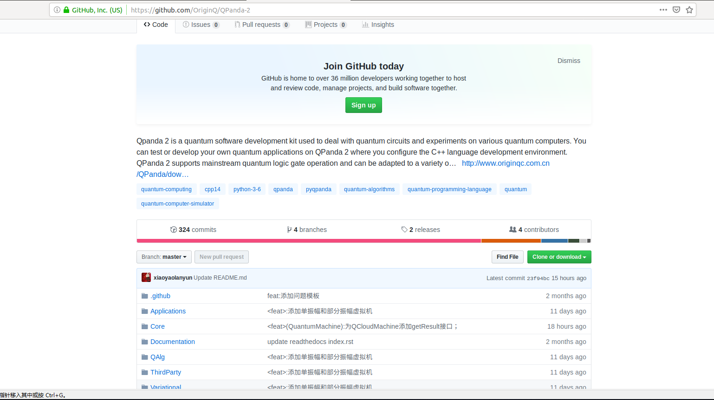

2. 点击 ***Clone or download*** 看到如下界面：

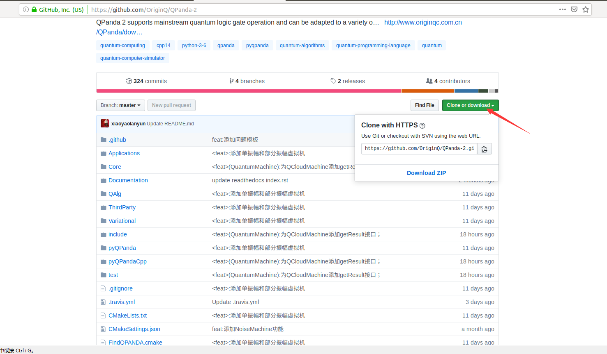

3. 然后点击 ***Download ZIP***， 就会完成QPanda2的下载。

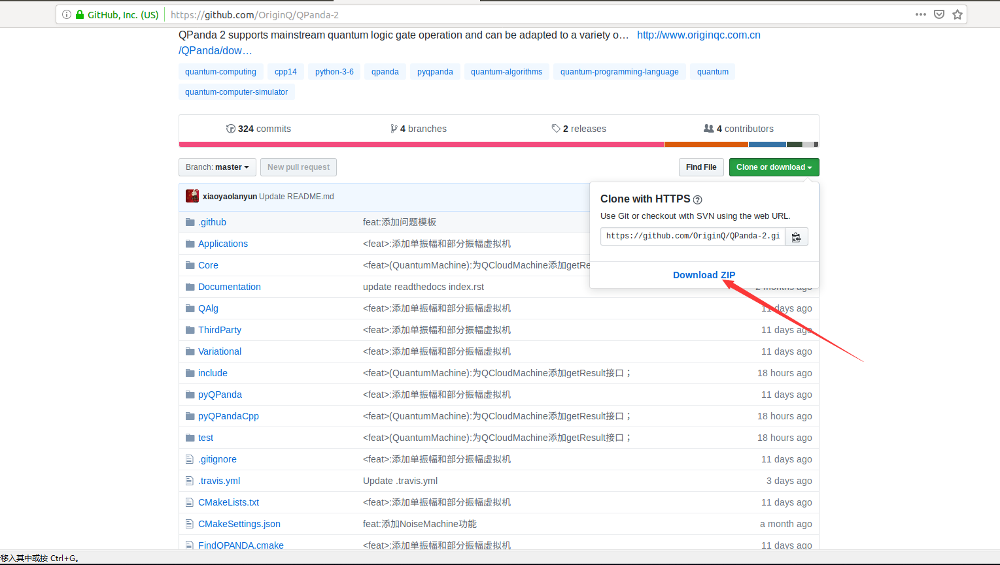

## 编译和安装

QPanda可以适配Windows、Linux、MacOS三种操作系统，所以下面分别介绍QPanda在这三种操作系统下的安装编译方式。

### Windows
在Windows平台下，QPanda支持使用Visual Studio和MinGW编译、安装。
#### Visual Studio
##### 编译

这里以Visual Studio 2017为例，使用Visual Studio 2017 编译QPanda,只需要安装Visual Studio 2017，并需要在组件中安装CMake组件。安装完成之后，用Visual Studio 2017打开QPanda文件夹，即可使用CMake编译QPanda。

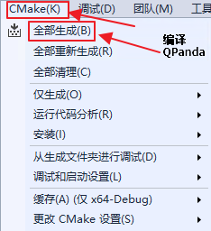

##### 安装

在QPanda编译完成后，用户可以安装QPanda，Visual Studio 2017的安装方式很简单，只需要在Cmake菜单中选择安装即可。

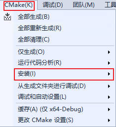

QPanda会安装在用户在CMakeSettings.json中配置的安装目录下。安装成功后会在用户配置的的目录下生成install文件夹，里面安装生成include和lib文件。如果有需求，用户可以在Visual Studio的CMakeSettings.json配置文件修改QPanda的安装路径。生成CMakeSettings.json的方法如下图所示：

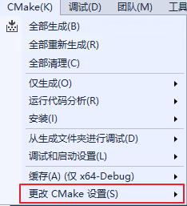

修改QPanda-2的安装路径如下图所示：

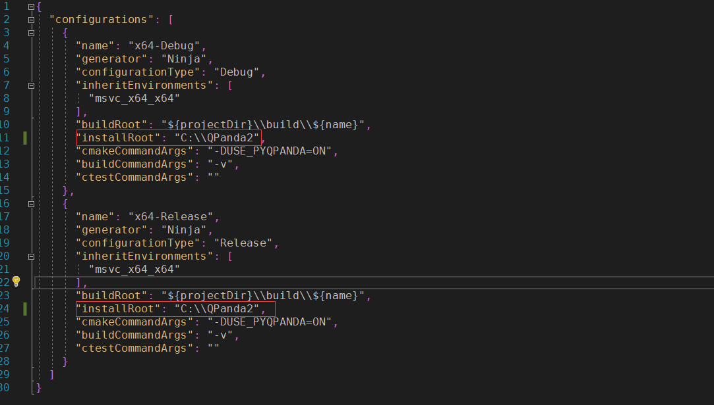

参数修改完成后，cmake选项下执行安装，Qpanda-2的lib库文件和include头文件会安装到用户指定的安装位置。(注意：需先进行编译成功后才能进行安装)

#### MinGW
##### 编译

使用MinGW编译QPanda-2，需要自行搭建CMake和MinGW环境，用户可自行在网上查询环境搭建教程。（注意： MinGW需要安装64位版本）

CMake+MinGW的编译命令如下：

在QPanda-2根目录下创建build文件夹
进入build文件夹，打开cmd
由于MinGW对CUDA的支持存在一些问题，所以在编译时需要禁掉CUDA，输入以下命令：

```
cmake -G"MinGW Makefiles" -DFIND_CUDA=OFF -DCMAKE_INSTALL_PREFIX=C:/QPanda2 ..
mingw32-make
```
##### 安装

在QPanda-2编译完成后，用户可以安装QPanda-2，安装命令如下：

```
mingw32-make install
```

### Linux 和 MacOS
#### 编译

进入QPanda-2根目录
输入以下命令：

```
mkdir -p build
cd build
cmake ..
make
```

如果有需求，用户通过命令修改QPanda-2的安装路径，配置方法如下所示：

```
mkdir -p build
cd build
cmake -DCMAKE_INSTALL_PREFIX=/usr/local ..
make
```
#### 安装
在Linux和MacOS下安装命令QPanda-2，命令是一样的，安装命令如下：

```
sudo make install
```

# 快速开始

我们接下来通过一个示例介绍QPanda-2的使用，下面的例子可以在量子计算机中构建量子纠缠态(|00>+|11>)，对其进行测量，重复制备1000次。 预期的结果是约有50%的概率使测量结果分别在00或11上。

```
#include "Core/QPanda.h"
#include <stdio.h>
using namespace QPanda;
int main()
{
    init(QMachineType::CPU);
    QProg prog;
    auto q = qAllocMany(2);
    auto c = cAllocMany(2);
    prog << H(q[0])
        << CNOT(q[0],q[1])
        << MeasureAll(q, c);
    auto results = runWithConfiguration(prog, c, 1000);
    for (auto result : results){
        printf("%s : %d\n", result.first.c_str(), result.second);
    }
    finalize();
}
```

示例程序的编译方式与编译QPanda库的方式基本类似，在这里就不多做赘述。我们在QPanda-2的github库中添加了  [Template](https://github.com/OriginQ/QPanda-2/tree/master/Template "Template")文件夹，用于展示各个平台的使用案例。

编译之后的可执行文件会生成在build下的bin文件夹中，进入到bin目录下就可以执行自己编写的量子程序了。

计算结果如下所示：
```
00 : 493
11 : 507
```

# 深入学习

## 量子逻辑门

经典计算中，最基本的单元是比特，而最基本的控制模式是逻辑门。我们可以通过逻辑门的组合来达到我们控制电路的目的。类似地，处理量子比特的方式就是量子逻辑门。 使用量子逻辑门，我们有意识的使量子态发生演化。所以量子逻辑门是构成量子算法的基础。

量子逻辑门由酉矩阵表示。最常见的量子门在一个或两个量子位的空间上工作，就像常见的经典逻辑门在一个或两个位上操作一样。

### 常见量子逻辑门矩阵形式

单比特量子逻辑门：

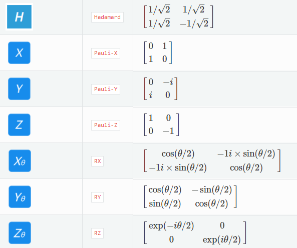

多比特量子逻辑门：
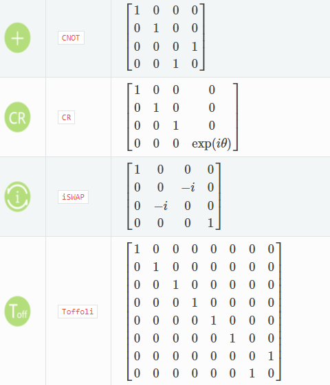

### 使用量子逻辑门

QPanda-2把所有的量子逻辑门封装为API向用户提供使用，并可获得QGate类型的返回值。比如，您想要使用Hadamard门，就可以通过如下方式获得：

```
QGate h = H(qubit);
```

可以看到，H函数只接收一个qubit，再比如，您想要使用RX门，可以通过如下方式获得：

```
QGate rx = RX(qubit，PI);
```

如上所示，RX门接收两个参数，第一个是目标量子比特，第二个偏转角度。您也可以通过相同的方式使用RY，RZ门。

两比特量子逻辑门的使用和单比特量子逻辑门的用法相似，只不过是输入的参数不同，举个使用CNOT的例子：

```
QGate cnot = CNOT(control_qubit，target_qubit);
```

CNOT门接收两个参数，第一个是控制比特，第二个是目标比特。

### QGate类型接口介绍

在本章的开头介绍过，所有的量子逻辑门都是酉矩阵，那么您也可以对量子逻辑门做转置共轭操作。QGate类型有两个成员函数可以做转置共轭操作： dagger、setDagger。

#### setDagger
setDagger的作用是根据输入参数更新当前量子逻辑门的dagger标记，在计算时计算后端会根据dagger判断当前量子逻辑门是否需要执行转置共轭操作。举个列子：

```
auto gate = H(qubit);
gate.setDagger(true);
```

setDagger有一个布尔类型参数，用来设置当前逻辑门是否需要转置共轭操作。

#### dagger

dagger的作用是复制一份当前的量子逻辑门，并更新复制的量子逻辑门的dagger标记。举个例子：

```
QGate rx_dagger = RX(qubit,PI).dagger();
```

除了转置共轭操作，您也可以为量子逻辑门添加控制比特，添加控制比特后，当前量子逻辑门是否执行需要根据控制比特的量子态决定。如果控制比特的量子态为|1>态时，当前量子逻辑门可被执行， 如果控制比特的量子态为|0>时，当前量子逻辑门不会被执行。QGate类型有两个成员函数帮助您添加控制比特：control、setControl。

#### setControl

setControl的作用是给当前的量子逻辑门添加控制比特，例如：

```
auto gate = RX(qubit,PI)
gate.setControl(qvec);
```
#### control

control的作用是复制当前的量子逻辑门，并给复制的量子逻辑门添加控制比特，例如：

```
QGate rx_control = RX(qubit,PI).control(qvec);
```

setControl、control都需要接收一个参数，参数类型为QVec，QVec是qubit的vector。

### 实例

以下实例主要是向您展现QGate类型接口的使用方式：
1. 使用init接口初始化一个量子虚拟机，向量子虚拟机申请3个量子比特，并把q[0],q[1]存放在一个量子比特容器中。
2. 调用CreateEmptyQProg构建一个量子程序prog;
3. 通过 << 操作符把量子逻辑门插入到prog中;
4. 调用qprobRunTupleList概率测量运行接口，就可以得到计算结果了。

```
#include "Core/QPanda.h"
using namespace QPanda；

int main(void)
{
    init(QMachineType::CPU);
    auto q = qAllocMany(3);
    QVec qubits = {q[0],q[1]};

    auto prog = CreateEmptyQProg();
    prog << H(q[0])
         << H(q[1])
         << H(q[0]).dagger()
         << X(q[2]).control(qubits);
    auto result = probRunTupleList(prog, q);
    for(auto & aiter : result)
    {
        std::cout << aiter.first << " : " << aiter.second << std::endl;
    }

    finalize();
    return 0;
}
```

计算结果如下：

```
000:0.5
010:0.5
```

## 量子线路

量子线路，也称量子逻辑电路是最常用的通用量子计算模型，表示在抽象概念下，对于量子比特进行操作的线路，是各种逻辑门组成的集合。最后常需要量子测量将结果读取出来。

由于组成量子线路的每一个量子逻辑门都是一个 酉矩阵 ，所以整个量子线路整体也是一个大的酉矩阵。

### 量子算法线路图

在目前的量子计算理论研究中，各种量子算法常用量子线路表示，比如下方列出的量子算法中的 ***HHL算法*** 量子线路图。

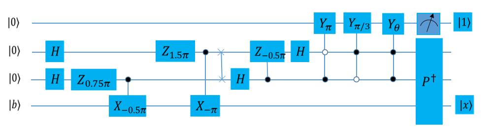

### 创建量子线路

在QPanda2中，QCircuit类是一个仅装载量子逻辑门和量子线路的容器类型，初始化一个QCircuit对象有以下两种：

C++风格
```
QCircuit cir = QCircuit();
```

C风格
```
QCircuit cir = CreateEmptyCircuit();
```

我们以通过<<操作符把量子逻辑门（QGate）/量子线路（QCircuit）插入到QCircuit尾部。
```
QCircuit circuit =  QCircuit();
circuit << H(qubit);
```

### QCircuit类型接口介绍

从上文可知量子线路也是一个酉矩阵，所有它也可以进行转置共轭操作和添加控制比特操作。

#### setDagger

setDagger的作用是根据输入参数更新当前量子线路的dagger标记，在计算时计算后端会根据dagger判断当前量子逻辑门是否需要执行转置共轭操作。举个例子：
```
QCircuit cir;
cir.setDagger(true);
```

该函数需要一个布尔类型参数，用来设置当前逻辑门是否需要转置共轭操作。

#### dagger

dagger的作用是复制一份当前的量子线路，并更新复制的量子线路的dagger标记。举个例子：
```
QCircuit cir;
QCircuit cir_dagger = cir.dagger();
```

#### setControl
setControl的作用是给当前的量子线路添加控制比特，例如：
```
QCircuit cir;
cir.setControl(qvec);
```

#### control

control的作用是复制当前的量子线路，并给复制的量子线路添加控制比特，例如：
```
QCircuit cir;
QCircuit cir_control = cir.control(qvec);
```
上述setControl、control都需要接收一个参数，参数类型为QVec，QVec是qubit的vector容器类型。

#### 注意

1. 向QCircuit中插入QPorg，QIf，Measure中不会报错，但是运行过程中可能会产生预料之外的错误。
2. 一个构建好的QCircuit不能直接参与量子计算与模拟，需要进一步构建成QProg类型。

#### 实例

以下实例主要是向您展现QCircuit类型接口的使用方式：
1. 初始化虚拟机环境：使用init接口初始化一个量子虚拟机，向量子虚拟机申请4个量子比特和4个经典寄存器；
2. 构建量子线路：调用CreateEmptyCircuit构建一个量子线路circuit，通过 << 操作符把量子逻辑门插入到circuit中，设置circuit的转置共轭操作为true。
3. 构建量子程序：调用CreateEmptyQProg接口构建一个量子程序prog，通过 << 操作符把circuit和量子逻辑门插入到prog；
4. 运行量子程序：调用runWithConfiguration测量运行接口，让量子程序运行1000遍，量子程序运行完后，就可以得到计算结果了。

```
#include "Core/QPanda.h"
USING_QPANDA

int main(void)
{
    init();
    auto qvec = qAllocMany(4);
    auto cbits = cAllocMany(4);
    auto circuit = CreateEmptyCircuit();

    circuit << H(qvec[0]) << CNOT(qvec[0], qvec[1])
            << CNOT(qvec[1], qvec[2]) << CNOT(qvec[2], qvec[3]);
    circuit.setDagger(true);
    auto prog = CreateEmptyQProg();
    prog << H(qvec[3]) << circuit << Measure(qvec[0], cbits[0]);

    auto result = runWithConfiguration(prog, cbits, 1000);
    for (auto &val : result)
    {
        std::cout << val.first << ", " << val.second << std::endl;
    }

    finalize();
    return 0;
}
```

计算结果如下所示：
```
0000, 510
1000, 490
```

## 构建模块化的量子线路

在比特数量比较多，量子算法比较复杂的情况下，可能我们需要把多个比较小的量子线路组成成一整个大的量子程序。

QPanda-2可以以一种比较方便的模式去构建这种模块。

### 用于生成量子线路（量子程序）的函数

QPanda中最常见的做法是用C++函数来定义一个量子线路模块。它通常具有一个QCircuit或者QProg类型的返回值。例如:
```
QCircuit foo(Qubit* qubit1, Qubit* qubit2)
{
    QCircuit cir;
    cir << H(qubit2) << CNOT(qubit1, qubit2) << H(qubit2);
    return cir;
}
```

这样的一个函数代表了一个模块（如图），当以不同的qubit1和qubit2作为输入的时候，它相当于把这个模块放置在了量子线路的不同位置。

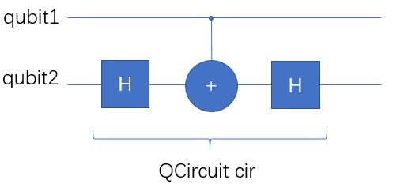

### Qubit分配（qAlloc）与映射

QPanda-2中量子比特是用一个Qubit*的指针对象进行表示的。Qubit本身不包含任何和量子态相关的数据，它只是一个用于映射物理量子比特的对象。

qAlloc这个函数可以从量子芯片未用到的量子比特池中申请一个量子比特。qAllocMany则可以申请到一批。

示例：
```
Qubit* q=qAlloc();
QVec qs=qAllocMany(3);
```

如图：

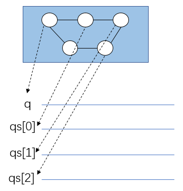

在任何时候Qubit * 类型的对象（或者Qvec容器中包含的每一个Qubit*）对象，都是映射到量子芯片上一个位置。 在一开始申请的时候，用户无需指定这种映射关系（通过allocateQubitThroughPhyAddress可以进行手动指定），程序后面可以通过自动的优化器来根据量子程序进行重新映射，以便得到最简的量子程序。


### 使用编写好的模块

前面写好的foo，就可以被用于不同的量子比特上，以构建一个更大的量子程序。例如我们可以把这一段线路作用在q和qs上：

```
QProg prog;
prog << foo(q, qs[0]) << foo(qs[1],qs[2]) << foo(qs[2], q);
```

这样，这个量子程序对应了下面这个量子线路：

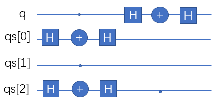

### 利用QVec（vector<Qubit*>)构建模块的方式

QVec继承了vector<Qubit*>类，因此它可以覆盖所有vector所包含的功能（operator[]，size()，push_back，iterator……），当然也可以利用C++11的新式for循环。

下面这个程序利用了一组量子比特（数量不定）去构建一个量子线路，对这组量子比特中每一个，都作用一个Hadamard门。

```
QCircuit foo2(QVec qs)
{
    QCircuit cir;
    for (auto qubit: qs){
        cir << H(q);
    }
    return cir;
}
```

如果qs中只有一个量子比特，那这个线路就是：

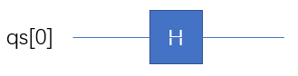

如果qs中有N个量子比特，那这个线路自然就是：

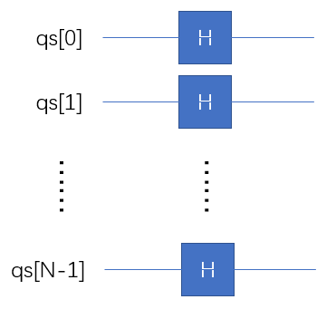

请问：下面这个量子程序代表了一个什么样的模块呢？

```
QCircuit foo3(QVec qs)
{
    QCircuit cir;
    cir << H(q[0]);
    for (int i=1;i<qs.size();++i)
    {
        cir << CNOT(q[i-1], q[i]);
    }
    return cir;
}
```

答案是如图所示：


## 量子程序

量子程序设计用于量子程序的编写与构造，一般地， 可以理解为一个操作序列。由于量子算法中也会包含经典计算，因而业界设想，最近将来出现的量子计算机是混合结构的，它包含两大部分一部分是经典计算机，负责执行经典计算与控制；另一部分是量子设备，负责执行量子计算。QPanda-2将量子程序的编程过程视作经典程序运行的一部分，在整个外围的宿主机程序中，一定包含创建量子程序的部分。

### 构建量子程序

在QPanda2中，QProg是量子编程的一个容器类，是一个量子程序的最高单位,初始化一个空的QProg对象有以下两种。

C++风格：
```
QProg prog = QProg();
```

C风格：
```
QProg prog = CreateEmptyQProg();
```

QCircuit、QIfProg、QWhileProg、QGate、QMeasure、ClassicalCondition可以隐式转换为QProg。

同时，我们以通过<<操作符把QCircuit、QIfProg、QWhileProg、QGate、QMeasure、ClassicalCondition插入到QProg尾部。

```
QProg prog =  QProg();
prog << H(qubit);
```

### QProg的接口

通常一个QProg类型内部结构复杂，需要对其进行拆分遍历等过程，QPanda2提供了相关接口。

获取QProg内部第一个节点与最后一个节点

```
QProg prog = QProg();
NodeIter first_node = prog.getFirstNodeIter();
NodeIter last_node  = prog.getLastNodeIter();
```

在QProg内部插入与删除节点操作

```
QProg prog = QProg();
NodeIter insert_node_iter = prog.insertQNode(NodeIter&, QNode*);
NodeIter delete_node_iter = prog.deleteQNode(NodeIter&);
```

NodeIter是一个类似于STL容器的迭代器类型，支持自增与自减等操作。

### 实例
以下实例，主要展现了QProg类型的使用方式。

1. 初始化虚拟机环境：使用init接口初始化一个量子虚拟机，向量子虚拟机申请4个量子比特和4个经典寄存器；

2. 构建量子程序：调用CreateEmptyQProg构建一个量子线路prog，通过 << 操作符把量子逻辑门插入到prog中；

3. 运行量子程序：调用runWithConfiguration测量运行接口，让量子程序运行1000遍，就可以得到计算结果了。

```
#include "Core/QPanda.h"
USING_QPANDA

int main(void)
{
    init();
    auto qvec = qAllocMany(4);
    auto cvec = cAllocMany(4);

    QProg prog;
    prog << H(qvec[0]) << X(qvec[1])
        << iSWAP(qvec[0], qvec[1])
        << CNOT(qvec[1], qvec[2])
        << H(qvec[3]) << MeasureAll(qvec ,cvec);

    auto result = runWithConfiguration(prog, cvec, 1000);
    for (auto &val : result)
    {
        std::cout << val.first << ", " << val.second << std::endl;
    }

    finalize();
    return 0;
}
```


## QWhile

QWhile即量子程序循环控制操作，输入参数为条件判断表达式和目标量子程序（量子线路），功能是执行while循环操作。

我们从前文可知如何构建量子程序，那么如何构建QWhile呢？QWhile的输入参数 ***条件判断表达式*** 又是否与传统while的判断表达式相同呢？

### 量子程序中的经典表达式与经典程序


### 构建QWhile

在QPanda2中，QWhileProg类用于表示执行量子程序while循环操作，初始化一个QWhileProg对象有以下两种方式：

C++风格：

```
QWhileProg qwile = QWhileProg(ClassicalCondition, QProg);
```

C风格：

```
QWhileProg qwile = CreateWhileProg(ClassicalCondition, QProg);
```

上述函数需要提供两个参数，即ClassicalCondition(经典表达式)与QProg(量子程序)

由于QCircuit、QIfProg、QWhileProg、QGate、QMeasure、ClassicalCondition可以隐式转换为QProg， 所以在构建QWhile时第二个参数也可以传入上述中的任意一种节点。

### QWhileProg的接口

QWhileProg的getTrueBranch接口可以获得QWhile操作的正确分支。

```
QWhileProg qwhile = CreateWhileProg(ClassicalCondition, QProg);
auto true_branch = qwhile.getTrueBranch();
```

也可以通过getCExpr获取经典表达式：
```
QWhileProg qwhile = CreateWhileProg(ClassicalCondition, QProg);
ClassicalCondition* expr = qwhile.getCExpr();
```
### 实例

以下实例主要是向您展现QWhileProg类型的使用方式：

1. 初始化虚拟机环境：使用init接口初始化一个量子虚拟机，构建一个量子程序prog，用来保存QWhile，向量子虚拟机申请3个量子比特和3个经典寄存器，并设置第一个经典寄存器cvec[0]的值为0；
2. 构建QWhile：构建一个量子线路prog_in，通过<< 操作符把量子逻辑门和经典表达式插入到prog_in中（这里需要特殊介绍H(qvec[cvec[0]])，它的意思是从qvec的cvec[0]位置取对应量子比特，并对该量子比特进行H门操作），然后通过CreateWhileProg接口构造一个qwhile，这个qwhile的判断条件是cvec[0]<3；
3. 运行量子程序：把qwhile插入到prog中，调用probRunTupleList概率测量运行接口，就可以得到计算结果了。。

```
#include "Core/QPanda.h"
USING_QPANDA

int main(void)
{
    init();
    QProg prog;
    auto qvec = qAllocMany(3);
    auto cvec = cAllocMany(3);
    cvec[0].setValue(0);

    QProg prog_in;
    prog_in<< cvec[0] << H(qvec[cvec[0]]) << (cvec[0] = cvec[0]+1);
    auto qwhile = CreateWhileProg(cvec[0]<3, prog_in);
    prog << qwhile;
    auto result = probRunTupleList(prog, qvec);

    for (auto & val : result)
    {
        std::cout << val.first << ", " << val.second << std::endl;
    }

    finalize();
    return 0;
}
```

运行结果：

```
0, 0.125

1, 0.125

2, 0.125

3, 0.125

4, 0.125

5, 0.125

6, 0.125

7, 0.125
```

## QIf

QIf表示量子程序条件判断操作，输入参数为条件判断表达式和量子程序，功能是执行条件判断。

### 构建Qif

在QPanda2中，QIfProg类用于表示执行量子程序条件判断操作，初始化一个QIfProg对象有以下两种方式：

C++风格：

```
QIfProg qif = QIfProg(ClassicalCondition, QProg);
QIfProg qif = QIfProg(ClassicalCondition, QProg, QProg);
```

C风格：
```
QIfProg qif = CreateIfProg(ClassicalCondition, QProg);
QIfProg qif = CreateIfProg(ClassicalCondition, QProg, QProg);
```

上述函数需要提供两种类型参数，即ClassicalCondition与QProg， 当传入1个QProg参数时，QProg表示正确分支，当传入2个QProg参数时，第一个表示正确分支，第二个表示错误分支。

由于QCircuit、QIfProg、QWhileProg、QGate、QMeasure、ClassicalCondition可以隐式转换为QProg， 所以在构建QIf时第二个参数或第三个参数也可以传入上述中的任意一种节点。

### QIfProg类的接口

QIfProg的函数getTrueBranch和getFalseBranch可以轻松获取QIf操作正确分支与错误分支。

```
QIfProg qif = CreateIfProg(ClassicalCondition, QProg, QProg);
QNode* true_branch  = qif.getTrueBranch();
QNode* false_branch = qif.getFalseBranch();
```

QIfProg的函数getCExpr可以获取经典表达式。
```
QIfProg qif = CreateIfProg(ClassicalCondition, QProg, QProg);
ClassicalCondition* expr = qif.getCExpr();
```
### 实例
以下实例，主要展现了QIf的使用方式。

1. 初始化虚拟机环境：使用init接口初始化一个量子虚拟机，构建一个量子程序prog ，用来保存QIf，向量子虚拟机申请3个量子比特和3个经典寄存器，并设置第一个和第二个经典寄存器的值为0 ；

2. 构建QIf：构建两个量子线路branch_true、branch_false，通过 << 操作符把量子逻辑门和经典表达式插入到branch_true和branch_false中，然后通过CreateIfProg接口构造一个qif，这个qif的判断条件是cvec[1]>5；

3. 运行量子程序：把qif插入到prog中，调用probRunTupleList概率测量运行接口，就可以得到计算结果了。

```
#include "Core/QPanda.h"
USING_QPANDA

int main(void)
{
    init();
    QProg prog;

    auto qvec = qAllocMany(3);
    auto cvec = cAllocMany(3);
    cvec[1].setValue(0);
    cvec[0].setValue(0);

    QProg branch_true;
    QProg branch_false;
    branch_true << (cvec[1]=cvec[1]+1) << H(qvec[cvec[0]]) 
                << (cvec[0]=cvec[0]+1);
    branch_false << H(qvec[0]) << CNOT(qvec[0],qvec[1]) 
                 << CNOT(qvec[1],qvec[2]);

    auto qif = CreateIfProg(cvec[1]>5, branch_true, branch_false);
    prog << qif;
    auto result = probRunTupleList(prog, qvec);

    for (auto & val : result)
    {
        std::cout << val.first << ", " << val.second << std::endl;
    }

    finalize();
    return 0;
}
```
运行结果：
```
0, 0.5
7, 0.5
1, 0
2, 0
3, 0
4, 0
5, 0
6, 0
```

## 量子虚拟机

量子虚拟机是用传统计算模拟执行量子程序，并输出计算结构，QPanda包含三种类型的量子虚拟机：1、全振幅量子虚拟机；2、部分振幅量子虚拟机；3、单振幅量子虚拟机；

### 全振幅量子虚拟机

全振幅量子虚拟机一次可以模拟计算出量子态的所有振幅，计算方式支持CPU、单线程计算和GPU，可以在初始化时配置，使用方式是完全一样的，只是其计算效率不同。

#### 构建全振幅量子虚拟机

全振幅量子虚拟机类型：

```
enum QMachineType {
    CPU,  /**< Cpu quantum machine  */
    GPU, /**< Gpu quantum machine  */
    CPU_SINGLE_THREAD, /**< Cpu quantum machine with single thread */
    NOISE  /**< Cpu quantum machine with  noise */
};
```
QPanda2中在构造量子虚拟机时有以下几种方式：

```
init(QMachineType::CPU);  // 使用init,不会返回qvm，会在代码中生成一个全局的qvm
auto qvm = initQuantumMachine(QMachineType::CPU); // 通过接口得到qvm指针
CPUQVM *qvm = new CPUQVM; // 直接new一个需要qvm类
```

***init*** 函数不是线程安全的，不适用于多线程编程，而且其最大的量子比特个数和经典寄存器个数均为默认值25。

设置量子虚拟机的配置(当前配置只有最大量子比特个数和最大经典寄存器个数):

```
Configuration conf;
conf.maxQubit = 30;
conf.maxCMem = 30;
qvm->setConfig(conf);
```
设置好配置之后要初始化量子虚拟机：

```
qvm->init();
```

调用 init 和 initQuantumMachine 接口时， 就不需要初始化了，量子虚拟机会使用默认配置。

#### 申请使用量子比特

在全振幅量子虚拟机构建完成之后，我们可以向量子虚拟机申请量子比特。例如我们申请4个量子比特：

```
QVec qubits = qvm->allocateQubits(4);
```

申请一个量子比特时也可以用这个接口：
```
Qubit* qubit = qvm->allocateQubit();
```

#### 申请使用经典寄存器
申请经典寄存器也有类似于申请量子比特的接口，其使用方法和申请量子比特的方法一样，如申请4个经典寄存器的方法：

```
std::vector<ClassicalCondition> cbits = qvm->allocateCBits(4);
```

申请一个经典寄存器时也可以用这个接口：

```
ClassicalCondition cbit = qvm->allocateCBit();
```

固定的经典寄存器地址上申请一个量子比特可以用下面的方法：
```
ClassicalCondition cbit = qvm->allocateCBit(1);
```
在一个量子虚拟机中，申请了几次量子比特或经典寄存器，我们想知道一共申请了多少个量子比特或经典寄存器可以用下面的方法：

```
size_t num_qubit = qvm->getAllocateQubit(); // 申请量子比特的个数
size_t num_cbit = qvm->getAllocateCMem(); // 申请经典寄存器的个数
```

我们该如何使用量子虚拟机来执行量子程序呢？ 可以用下面的方法：

```
QProg prog;
prog << H(qubits[0])
    << CNOT(qubits[0], qubits[1])
    << Measure(qubits[0], cbits[0]); // 构建一个量子程序

map<string, bool> result = qvm->directlyRun(prog); // 执行量子程序
```
如果想多次运行一个量子程序，并得到每次量子程序的结果，除了循环调用 directlyRun 方法外， 我们还提供了一个接口 runWithConfiguration 。 为了以后的扩展， runWithConfiguration 配置参数是一个rapidjson::Document类型的参数， rapidjson::Document保存的是一个Json对象，由于现在只支持 量子程序运行次数的配置， 其json数据结构为：

```
{
    "shots":1000
}
```

利用rapidjson库去得到rapidjson::Document对象， rapidjson的使用可以参照 Rapidjson首页 。举个例子如下：
```
int shots = 1000;
rapidjson::Document doc;
doc.Parse("{}");
doc.AddMember("shots",
    shots,
    doc.GetAllocator());
qvm->runWithConfiguration(prog, cbits, doc);
```
如果想得到量子程序运行之后各个量子态的振幅值，可以调用 getQState 函数获得：

```
QStat stat = qvm->getQState();
```

#### 实例
以下实例主要是向您展现全振幅量子虚拟机接口的使用方式:
1.	初始化虚拟机环境：构建一个以CPU为计算单元的量子虚拟机，向量子虚拟机申请4个量子比特和4个经典寄存器；
2.	构建量子程序：调用CreateEmptyQProg构建一个量子线路prog，通过 << 操作符把量子逻辑门插入到prog中；
3.	运行量子程序：调用runWithConfiguration测量运行接口，让量子程序运行1000遍，就可以得到计算结果了。

```
#include "Core/QPanda.h"
USING_QPANDA

int main(void)
{
    CPUQVM qvm;
    qvm.init();
    auto qubits = qvm.allocateQubits(4);
    auto cbits = qvm.allocateCBits(4);

    QProg prog;
    prog << H(qubits[0])
        << CNOT(qubits[0], qubits[1])
        << CNOT(qubits[1], qubits[2])
        << CNOT(qubits[2], qubits[3])
        << Measure(qubits[0], cbits[0]);

    int shots = 1000;
    rapidjson::Document doc;
    doc.Parse("{}");
    doc.AddMember("shots", shots, doc.GetAllocator());
    auto result = qvm.runWithConfiguration(prog, cbits, doc);

    for (auto &val : result)
    {
        std::cout << val.first << ", " << val.second << std::endl;
    }

    qvm.finalize();
    return 0;
}
```

运行结果：
```
0000, 498
1000, 502
```

#### 函数对照表
QPanda2中还提供了一些面向过程的接口，其使用方法和面向对象的方式相似，下面提供一份面向对象与面向过程的函数对照表：

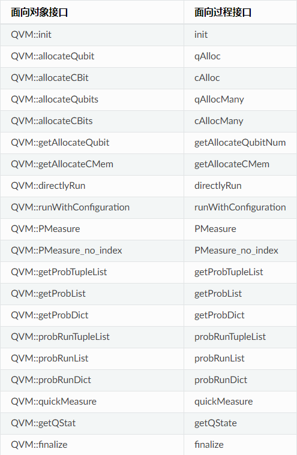

#### 实例2 
以下实例主要是向您展现全振幅量子虚拟机接口的使用方式，
1.	初始化虚拟机环境：调用init接口构建一个量子虚拟机，向量子虚拟机申请4个量子比特和4个经典寄存器；
2.	构建量子程序：构建一个量子线路prog，通过 << 操作符把量子逻辑门插入到prog中；
3.	运行量子程序：调用directlyRun测量运行接口，让量子程序运行1遍，就可以得到计算结果了。

```
#include "Core/QPanda.h"
USING_QPANDA

int main(void)
{
    init();
    auto qubits = qAllocMany(4);
    auto cbits = cAllocMany(4);

    QProg prog;
    prog << H(qubits[0])
        << CNOT(qubits[0], qubits[1])
        << CNOT(qubits[1], qubits[2])
        << CNOT(qubits[2], qubits[3])
        << Measure(qubits[0], cbits[0]);

    auto result = directlyRun(prog);
    for (auto &val : result)
    {
        std::cout << val.first << ", " << val.second << std::endl;
    }

    finalize();
    return 0;
}
```

运行结果：
```
c0, 1
```

### 含噪声量子虚拟机

在真实的量子计算机中，受制于量子比特自身的物理特性，常常存在不可避免的计算误差。为了能在量子虚拟机中更好的模拟这种误差，在 全振幅量子虚拟机 的基础上， QPanda2带来了含噪声量子虚拟机。含噪声量子虚拟机的模拟更贴近真实的量子计算机，我们可以自定义支持的逻辑门类型，自定义逻辑门支持的噪声模型， 通过这些自定义形式，我们使用QPanda2开发量子程序的现实应用程度将更高。

#### 接口介绍

含噪声量子虚拟机的接口和其他量子虚拟机的接口大部分是相同的，但含噪声量子虚拟机不能使用PMEASURE系列的概率测量接口。此外QPanda2给它重载了一个init成员函数， 该成员函数可接收一个rapidjson::Document类型的参数，rapidjson::Document保存的是一个Json对象，我们可以在参数中定义含噪声量子虚拟机支持的量子逻辑门类型和 噪声模型，Json的结构如下所示：

```
{
    “gates”:[.....],
    "noisemodel":{.....}}
}
```

假设我们希望自定含噪声量子虚拟机支持的逻辑门是RX、RY、CNOT，并且希望设定RX,RY的噪声模型为DECOHERENCE_KRAUS_OPERATOR，那么我们把Json构造成以下形式：

```
{
    “gates”:[["RX","RY"],["CNOT"]],
    "noisemodel":{"RX":[DECOHERENCE_KRAUS_OPERATOR,10.0,2.0,0.03],
                  "RY":[DECOHERENCE_KRAUS_OPERATOR,10.0,2.0,0.03]}}
}
```
rapidjson如何使用，我们可以到 [Rapidjson首页](http://rapidjson.org/ "Rapidjson首页") 学习，这里先举个集合QPanda2使用的例子：

```
rapidjson::Document doc;
doc.Parse("{}");

Value value(rapidjson::kObjectType);
Value value_rx(rapidjson::kArrayType);
value_rx.PushBack(DECOHERENCE_KRAUS_OPERATOR, doc.GetAllocator());
value_rx.PushBack(10.0, doc.GetAllocator());
value_rx.PushBack(2.0, doc.GetAllocator());
value_rx.PushBack(0.03, doc.GetAllocator());
value.AddMember("RX", value_rx, doc.GetAllocator());

Value value_ry(rapidjson::kArrayType);
value_ry.PushBack(DECOHERENCE_KRAUS_OPERATOR, doc1.GetAllocator());
value_ry.PushBack(10.0, doc1.GetAllocator());
value_ry.PushBack(2.0, doc1.GetAllocator());
value_ry.PushBack(0.03, doc1.GetAllocator());
value.AddMember("RY", value_ry, doc1.GetAllocator());
doc.AddMember("noisemodel", value, doc1.GetAllocator());
NoiseQVM qvm；
qvm.init(doc);
```
#### 噪声模型介绍

QPanda2的含噪声量子虚拟机为我们提供了丰富的噪声模型，我们可以自定义噪声模型和量子逻辑门的对应关系。噪声模型主要分为两种：单门噪声模型和双门噪声模型。

##### 单门噪声模型
###### DAMPING_KRAUS_OPERATOR
DAMPING_KRAUS_OPERATOR是量子比特的弛豫过程噪声模型，它的kraus算符和表示方法如下图所示：

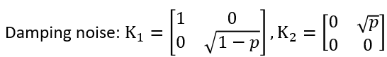

我们可以看到，DAMPING_KRAUS_OPERATOR需要一个参数P，该参数是double类型的，所以我们在构造Json的时候需要用以下形式（假设设定RX的噪声模型,当然输入的参数也是假定的）：
```
{
    .....
    "noisemodel":{"RX":[DAMPING_KRAUS_OPERATOR,3.0],
                   ......}
}
```

###### DAMPING_KRAUS_OPERATOR
DEPHASING_KRAUS_OPERATOR是量子比特的退相位过程噪声模型，它的kraus算符和表示方法如下图所示：
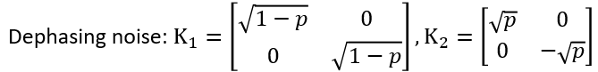

我们可以看到，DEPHASING_KRAUS_OPERATOR需要一个参数P，该参数是double类型的，所以我们在构造Json的时候需要用以下形式（假设设定RX的噪声模型）：

```
{
    .....
    "noisemodel":{"RX":[DEPHASING_KRAUS_OPERATOR,2.0],
                   ......}
}
```
###### DECOHERENCE_KRAUS_OPERATOR

DECOHERENCE_KRAUS_OPERATOR是上述两种噪声模型的综合，他们的关系如下图所示：
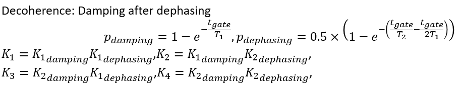

我们可以看到，DEPHASING_KRAUS_OPERATOR需要三个参数T1，T2，tgate，所有的参数是double类型的，所以我们在构造Json的时候需要用以下形式（假设设定RX的噪声模型）：

```
{
    .....
    "noisemodel":{"RX":[DEPHASING_KRAUS_OPERATOR,2.0],
                   ......}
}
```
##### 双门噪声模型

双门噪声模型同样也分为三种：DOUBLE_DAMPING_KRAUS_OPERATOR、DOUBLE_DEPHASING_KRAUS_OPERATOR、DOUBLE_DECOHERENCE_KRAUS_OPERATOR。 它们的输入参数与单门噪声模型一致，双门噪声模型的kraus算符和表示与单门噪声模型存在着对应关系：假设单门噪声模型为： {K1,K2}{K1,K2} ，那么对应的双门噪声模型为 {K1⊗K1,K1⊗K2,K2⊗K1,K2⊗K2}{K1⊗K1,K1⊗K2,K2⊗K1,K2⊗K2}。

### 单振幅量子虚拟机

目前我们可以通过量子计算的相关理论，用经典计算机实现模拟量子虚拟机。 量子虚拟机的模拟主要有全振幅与单振幅两种解决方案，其主要区别在于，全振幅一次模拟计算就能算出量子态的所有振幅，单振幅一次模拟计算只能计算出2的N次方个振幅中的一个。

然而全振幅模拟量子计算时间较长，计算量随量子比特数指数增长， 在现有硬件下，无法模拟超过49量子比特。通过单振幅量子虚拟机技术可以模拟超过49比特，同时模拟速度有较大提升，且算法的计算量不随量子比特数指数提升。

#### 实例 
以下实例主要是向您展现单振幅量子虚拟机接口的使用方式，
1.	初始化虚拟机环境：调用init接口构建一个量子虚拟机，向量子虚拟机申请10个量子比特
2.	构建量子程序：构建一个量子线路prog，通过 << 操作符把量子逻辑门插入到prog中；
3.	运行量子程序：调用getQStat接口，获取量子态所有分量的振幅。

```
#include "Core/QPanda.h"
#include "Core/QuantumMachine/SingleAmplitudeQVM.h"
USING_QPANDA

int main(void)
{
    auto machine = new SingleAmplitudeQVM();
    machine->init();

    auto prog = QProg();
    auto qlist = machine->allocateQubits(10);

    for_each(qlist.begin(), qlist.end(), [&](Qubit *val) { prog << H(val); });
    prog << CZ(qlist[1], qlist[5])
         << CZ(qlist[3], qlist[5])
         << CZ(qlist[2], qlist[4])
         << CZ(qlist[3], qlist[7])
         << CZ(qlist[0], qlist[4])
         << RY(qlist[7], PI / 2)
         << RX(qlist[8], PI / 2)
         << RX(qlist[9], PI / 2)
         << CR(qlist[0], qlist[1], PI)
         << CR(qlist[2], qlist[3], PI)
         << RY(qlist[4], PI / 2)
         << RZ(qlist[5], PI / 4)
         << RX(qlist[6], PI / 2)
         << RZ(qlist[7], PI / 4)
         << CR(qlist[8], qlist[9], PI)
         << CR(qlist[1], qlist[2], PI)
         << RY(qlist[3], PI / 2)
         << RX(qlist[4], PI / 2)
         << RX(qlist[5], PI / 2)
         << CR(qlist[9], qlist[1], PI)
         << RY(qlist[1], PI / 2)
         << RY(qlist[2], PI / 2)
         << RZ(qlist[3], PI / 4)
         << CR(qlist[7], qlist[8], PI);

    machine->run(prog);
    auto res = machine->getQStat();
    cout << res["0000000000"] << endl;
    cout << res["0000000001"] << endl;
```
getQStat()接口表示获取量子态所有分量的振幅，输出结果用map容器保存，key为量子态对应的字符串，value为对应的振幅，上述程序的计算结果如下：

```
(0.040830060839653015,-9.313225746154785e-10j)
(0.040830060839653015,-9.313225746154785e-10j)
...
```

#### 其他接口

PMeasure(std::string) ,输入的参数表示获取测量所有比特构成量子态的概率的结果集的前多少项，比如如下例子，我们获取所有量子态的概率分布结果的前6项，程序运行如下：

```
auto res = machine->PMeasure("6");
for (auto val :res)
{
    std::cout << val.first << " : " << val.second << std::endl;
}
```

结果输出如下，每个结果的序号表示量子态的下标，后面的值表示概率：

```
0 : 0.00166709
1 : 0.00166709
2 : 0.000286028
3 : 0.000286028
4 : 0.000286028
5 : 0.000286028
```

PMeasure(QVec,std::string) ,输入的第一个参数表示选取哪几个量子比特构成的量子态的概率，第二个参数表示选取结果的前多少项，使用示例如下：

```
QVec qv = { qlist[1],qlist[2],qlist[3] ,qlist[4] ,qlist[5] ,qlist[6] ,qlist[7] ,qlist[8],qlist[9] };
auto res2 = machine->PMeasure(qv, "6");

for (auto val :res)
{
    std::cout << val.first << " : " << val.second << std::endl;
}
```
结果输出如下，每个结果的序号表示量子态的下标，后面的值表示概率：

```
0 : 0.00333419
1 : 0.000572056
2 : 0.000572056
3 : 0.00333419
4 : 0.00333419
5 : 0.000572056
```

### 部分振幅量子虚拟机

 部分振幅算法的基本思想是将大比特的量子计算线路图拆分成若干个小比特线路图，具体数量视线路复杂情况而定。

 #### 实例 

 以下实例主要是向您展现全振幅量子虚拟机接口的使用方式，
1.	初始化虚拟机环境：构建一个部分振幅量子虚拟机，向量子虚拟机申请10个量子比特；
2.	构建量子程序：构建一个量子线路prog，通过 << 操作符把量子逻辑门插入到prog中；
3.	运行量子程序：调用run装载量子程序，调用getQStat接口得到获取量子态所有分量的振幅。

```
#include "QPanda.h"
USING_QPANDA

int main(void)
{
    auto machine = new PartialAmplitudeQVM();
    machine->init();

    auto qlist = machine->allocateQubits(10);

    auto prog = QProg();
    for_each(qlist.begin(), qlist.end(), [&](Qubit *val) { prog << H(val); });
    prog << CZ(qlist[1], qlist[5])
         << CZ(qlist[3], qlist[7])
         << CZ(qlist[0], qlist[4])
         << RZ(qlist[7], PI / 4)
         << RX(qlist[5], PI / 4)
         << RX(qlist[4], PI / 4)
         << RY(qlist[3], PI / 4)
         << CZ(qlist[2], qlist[6])
         << RZ(qlist[3], PI / 4)
         << RZ(qlist[8], PI / 4)
         << CZ(qlist[9], qlist[5])
         << RY(qlist[2], PI / 4)
         << RZ(qlist[9], PI / 4)
         << CR(qlist[2], qlist[7], PI / 2);

    machine->run(prog);
    auto res = machine->getQStat();
    cout << res["0000000000"] << endl;
    cout << res["0000000001"] << endl;
```
上述程序使用的接口为getQStat()，即获取量子态所有分量的振幅，计算结果如下

```
(-0.00647209,-0.00647209)
(8.5444e-18,-0.00915291)
...
```

#### 其他接口
部分振幅与单振幅的接口使用方式相同，不过部分振幅增加了一个接口PMeasureSubSet(QProg &, std::vector<std::string>，输入的第一个参数表示待运行的量子线路，第二个参数表示需要测量的量子态二进制下标形式构成的子集，该接口可获取整个量子态分量的任意子集的振幅，使用示例如下：

```
std::vector<std::string> set = { "0000000000","0000000001","0000000100" };
auto res = machine->PMeasureSubSet(prog, set);

for (auto val : res)
{
    std::cout << val.first << " : " << val.second << endl;
}
```
结果输出如下
```
0000000000 : 8.37758e-05
0000000001 : 8.37758e-05
0000000100 : 0.000488281
```

## 量子测量

量子测量是指通过外界对量子系统进行干扰来获取需要的信息，测量门使用的是蒙特卡洛方法的测量。

### 构建测量操作

在量子程序中我们需要对某个量子比特做测量操作，并把测量结果存储到经典寄存器上，可以通过下面的方式获得一个测量对象：

```
auto measure = Measure(qubit, cbit);
```
可以看到Measure接两个参数， 第一个是测量比特，第二个是经典寄存器。

如果想测量所有的量子比特并将其存储到对应的经典寄存器上， 可以如下操作：

```
auto measure_all = MeasureAll(qubits， cbits);
```

MeasureAll 的返回值类型是 QProg。其中qubits的类型是 QVec ， cbits的类型是 vector<ClassicalCondition>。

### 获取测量结果

在得到含有量子测量的程序后，我们可以调用 directlyRun 或 runWithConfiguration 来得到量子程序的测量结果。
directlyRun 的功能是运行量子程序并返回运行的结果， 使用方法如下：
```
QProg prog;
prog << H(qubits[0])
    << CNOT(qubits[0], qubits[1])
    << CNOT(qubits[1], qubits[2])
    << CNOT(qubits[2], qubits[3])
    << Measure(qubits[0], cbits[0]);

auto result = directlyRun(prog);
```
runWithConfiguration 的功能是末态在目标量子比特序列在量子程序多次运行结果中出现的次数， 使用方法如下：
```
QProg prog;
prog   << H(qubits[0])
        << H(qubits[1])
        << H(qubits[2])
        << H(qubits[3])
        << MeasureAll(qubits, cbits); // 测量所有的量子比特

auto result = runWithConfiguration(prog, cbits, 1000);
```

其中第一个参数是量子程序，第二个参数是经典寄存器， 第三个参数是运行的次数。

### 实例
```
#include "Core/QPanda.h"
USING_QPANDA

int main(void)
{
    auto qvm = initQuantumMachine();
    auto qubits = qvm->allocateQubits(4);
    auto cbits = qvm->allocateCBits(4);
    QProg prog;

    prog   << H(qubits[0])
            << H(qubits[1])
            << H(qubits[2])
            << H(qubits[3])
            << MeasureAll(qubits, cbits);

    auto result = runWithConfiguration(prog, cbits, 1000);
    for (auto &val: result)
    {
        std::cout << val.first << ", " << val.second << std::endl;
    }

    qvm->finalize();
    delete qvm;

    return 0;
}
```
运行结果：

```
0000, 47
0001, 59
0010, 74
0011, 66
0100, 48
0101, 62
0110, 71
0111, 61
1000, 70
1001, 57
1010, 68
1011, 63
1100, 65
1101, 73
1110, 55
1111, 61
```

## 概率测量

概率测量是指获得目标量子比特的振幅，目标量子比特可以是一个量子比特也可以是多个量子比特的集合。 在QPanda2中概率测量又称为 PMeasure 。 概率测量和 量子测量 是完全不同的过程，Measure是执行了一次测量， 并返回一个确定的0/1结果，并且改变了量子态， PMeasure是获得我们所关注的量子比特的振幅，并不会改变量子态，PMeasure的输入参数是 QVec， 它指定了我们关注的量子比特。 例如，一共有10个Qubit的系统，我们指定了前三个Qubit作为PMeasure的目标，就会输出一个长度为8的vector。

### 接口介绍

QPanda2提供了三种获得PMeasure结果的方式，其中有 probRunList 、 probRunTupleList 、 probRunDict。

1. probRunList ： 获得目标量子比特的概率测量结果， 并没有其对应的下标。
2. probRunTupleList： 获得目标量子比特的概率测量结果， 其对应的下标为十进制。
3. probRunDict ： 获得目标量子比特的概率测量结果， 其对应的下标为二进制。

这三个函数的使用方式是一样的，下面就以 probRunDict 为例介绍，使用方式如下：

```
auto qubits = qvm->allocateQubits(4);

QProg prog;
prog   << H(qubits[0])
        << CNOT(qubits[0], qubits[1])
        << CNOT(qubits[1], qubits[2])
        << CNOT(qubits[2], qubits[3]);
auto result = probRunDict(prog, qubits， 3);
```
第一个参数是量子程序， 第二个参数是 QVec 它指定了我们关注的量子比特。 第三个参的值为-1时，是指我们以第二个参数中所有的量子比特作为目标，当其值不为-1时，则表示我们关注 QVec 中的前几个。 如上述例子，一共有4个Qubit的系统， 第三个参数设置为3，得到结果将会是8个元素。

除了上述的方式外，我们还可以先使用 directlyRun， 再调用 getProbList 、 getProbTupleList 、 getProbDict 得到和上述三种方法一样的结果。

### 实例

```
#include "Core/QPanda.h"
USING_QPANDA

int main(void)
{
    auto qvm = initQuantumMachine();
    auto qubits = qvm->allocateQubits(2);

    QProg prog;
    prog << H(qubits[0])
        << CNOT(qubits[0], qubits[1]);

    std::cout << "probRunDict: " << std::endl;
    auto result1 = probRunDict(prog, qubits);
    for (auto &val: result1)
    {
        std::cout << val.first << ", " << val.second << std::endl;
    }

    std::cout << "probRunTupleList: " << std::endl;
    auto result2 = probRunTupleList(prog, qubits);
    for (auto &val: result2)
    {
        std::cout << val.first << ", " << val.second << std::endl;
    }

    std::cout << "probRunList: " << std::endl;
    auto result3 = probRunList(prog, qubits);
    for (auto &val: result3)
    {
        std::cout << val<< std::endl;
    }

    qvm->finalize();
    delete qvm;
    return 0;
}
```
运行结果：

```
probRunDict:
00, 0.5
01, 0
10, 0
11, 0.5
probRunTupleList:
0, 0.5
3, 0.5
1, 0
2, 0
probRunList:
0.5
0
0
0.5
```

# 实用工具

## 逻辑门统计
逻辑门的统计是指统计量子程序、量子线路、量子循环控制或量子条件控制中所有的量子逻辑门（这里也会将测量操作统计进去）个数方法。

### 接口介绍

QGateCounter 类是统计一个量子程序(量子线路、量子循环控制、量子条件控制)中量子逻辑门个数的工具类，我们先用QPanda2构建一个量子程序：

```
auto qubits = qAllocMany(4);
auto cbits = cAllocMany(4);

QProg prog;
prog << X(qubits[0])
    << Y(qubits[1])
    << H(qubits[0])
    << RX(qubits[0], 3.14)
    << Measure(qubits[1], cbits[0]);
```

然后调用 QGateCounter 类统计量子逻辑门的个数，


```
QGateCounter t;
t.traversal(prog);
size_t num = t.count(prog);
```

我们还可以使用QPanda2封装的一个接口：
```
size_t num = getQGateNumber(prog);
```

### 实例

```
#include "Core/QPanda.h"
USING_QPANDA

int main(void)
{
    init();
    auto qubits = qAllocMany(4);
    auto cbits = cAllocMany(4);

    QProg prog;
    prog << X(qubits[0])
        << Y(qubits[1])
        << H(qubits[0])
        << RX(qubits[0], 3.14)
        << Measure(qubits[1], cbits[0]);

    size_t num = getQGateNumber(prog);
    std::cout << "QGate number: " << num << std::endl;
    finalize();

    return 0;
}
```
运行结果：
```
QGate number: 5
```

## 统计量子程序时钟周期

已知每个量子逻辑门在运行时所需时间的条件下，估算一个量子程序运行所需要的时间。每个量子逻辑门的时间设置在项目的元数据配置文件 QPandaConfig.xml 中， 如果未设置则会给定一个默认值，单量子门的默认时间为2，双量子门的时间为5。

配置文件可仿照下面设置:

```
<QGate>
    <SingleGate>
        <Gate time = "2">rx</Gate>
        <Gate time = "2">Ry</Gate>
        <Gate time = "2">RZ</Gate>
        <Gate time = "2">S</Gate>
        <Gate time = "2">H</Gate>
        <Gate time = "2">X1</Gate>
    </SingleGate>
    <DoubleGate>
        <Gate time = "5">CNOT</Gate>
        <Gate time = "5">CZ</Gate>
        <Gate time = "5">ISWAP</Gate>
    </DoubleGate>
</QGate>
```

### 接口介绍

QProgClockCycle 类是QPanda 2提供的一个统计量子程序时钟周期的工具类，我们先用QPanda 2构建一个量子程序：
```
auto qubits = qvm->allocateQubits(4);
auto prog = CreateEmptyQProg();
prog << H(qubits[0]) << CNOT(qubits[0], qubits[1])
        << iSWAP(qubits[1], qubits[2]) << RX(qubits[3], PI/4);
```

然后调用 QProgClockCycle 类得到量子程序的时钟周期

```
QProgClockCycle t(qvm);
t.traversal(prog);
auto time = t.count();
```

我们还可以使用QPanda2封装的一个接口：

```
auto time = getQProgClockCycle(prog,qvm);
```

### 实例

```
#include "Core/QPanda.h"
USING_QPANDA

int main(void)
{
    auto qvm = initQuantumMachine();
    auto qubits = qvm->allocateQubits(4);
    auto prog = CreateEmptyQProg();
    prog << H(qubits[0]) << CNOT(qubits[0], qubits[1])
            << iSWAP(qubits[1], qubits[2]) << RX(qubits[3], PI/4);

    auto time = getQProgClockCycle(prog, qvm);
    std::cout << "clockCycle : " << time << std::endl;
    destroyQuantumMachine(qvm);

    return 0;
}
```
运行结果：
```
clockCycle : 14
```

## 量子门的有效性
### 量子门的分类

量子门主要分为单量子门、双量子门和三量子门，根据量子芯片中元数据不同的单量子门或双量子门组合对单量子门和双量子门又分为了不同的类型，下面分别对单量子门和双量子门进行介绍。

### 单比特逻辑门判断
单量子门可分为四种情况：任意旋转类，双连续类，单连续单离散类，双离散类。下面根据量子芯片的元数据判断单量子门所属类型。

1. ***任意旋转类***：需要判断元数据提供的单量子门的容器中是否存在 U3 、 U2 的量子门类型，如果存在则是任意旋转类，如果不存在则不是任意旋转类；
2. ***双连续类***：需要判断元数据提供的单量子门的容器中是否存在 RX+RZ 、 RX+RY 、 RY+RZ 这三种组合，如果存在则是双连续类，如果不存在则不是双连续类；
3. ***单连续单离散类***：第一步，需要判断元数据提供的单量子门的容器中是否存在 RX 、 RY 、 RZ 这三种量子门；第二步，如果存在 RX，不存在 RY 、 RZ，则查找容器中是否有 Y 、 H 、 Z 量子门中的一种，如果存在则是单连续单离散类，如果不存在则不是单连续单离散类。如果存在 RY，不存在 RX 、 RZ，则查找容器中是否有 X 、 H 、 Z 量子门中的一种，如果存在则是单连续单离散类，如果不存在则不是单连续单离散类。如果存在 RZ ，不存在 RX 、 RY ,则查找容器中是否存在 X 、 H 、 Y 中的一种，如果存在则是单连续单离散类，如果不存在则不是单连续单离散类。
4. ***双离散类***：如果元数据提供的单量子门的容器中不存在 RX 、 RY 、 RZ 这三种量子门，则判断 H+T 、 X+T 、 Y+T 的组合，如果存在则是双离散类，如果不存在则不是双离散类。

当以上四种情况都不存在时，就无法把任意单门转换为量子芯片元数据支持的量子门。

### 双量子门判断

双量子门需要判断元数据提供的双量子门的容器中是否 CNOT 、 SWAP 门，如果存在则元数据可用，如果不存在则就无法把任意双门转换为量子芯片元数据支持的量子门。

### 判断量子门有效性的方法

判断量子门有效性是由 SingleGateTypeValidator 和 DoubleGateTypeValidator 两个类实现的。下面分别对这两个类中的接口介绍。

###  接口介绍

SingleGateTypeValidator 是验证单量子逻辑门有效性的工具类，使用方式如下：

```
std::vector<std::string> single_gate;
std::vector<std::string> valid_single_gate; // 有效的量子逻辑门组合会输出到这个容器中
single_gate.push_back("T");
single_gate.push_back("H");
single_gate.push_back("S");
auto single_gate_type = 
    SingleGateTypeValidator::GateType(single_gate, valid_single_gate); 
    // 得到有效的量子逻辑门组合，和有效组合的类型
```
DoubleGateTypeValidator 是验证双量子逻辑门有效性的工具类，使用方式如下：


```
std::vector<std::string> double_gate;
std::vector<std::string> valid_double_gate; // 有效的量子逻辑门组合会输出到这个容器中
double_gate.push_back("CNOT");
double_gate.push_back("SWAP");
double_gate.push_back("CZ");
auto double_gate_type = 
    DoubleGateTypeValidator::GateType(double_gate, valid_double_gate); 
    // 得到有效的量子逻辑门组合，和有效组合的类型
```
### 实例

```
#include "Core/QPanda.h"
USING_QPANDA

int main(void)
{
    // 单量子门有效性验证
    std::vector<std::string> single_gate;
    std::vector<std::string> valid_single_gate; // 有效的量子逻辑门组合会输出到这个容器中
    single_gate.push_back("T");
    single_gate.push_back("H");
    single_gate.push_back("S");

    // 得到有效的量子逻辑门组合，和有效组合的类型
    auto single_gate_type = 
        SingleGateTypeValidator::GateType(single_gate, valid_single_gate);


    for (auto &val : valid_single_gate)
    {
        std::cout << val << " ";
    }
    std::cout << std::endl;

    // 双量子门有效性验证
    std::vector<std::string> double_gate;
    std::vector<std::string> valid_double_gate; // 有效的量子逻辑门组合会输出到这个容器中
    double_gate.push_back("CNOT");
    double_gate.push_back("SWAP");
    double_gate.push_back("CZ");

    // 得到有效的量子逻辑门组合，和有效组合的类型
    auto double_gate_type = 
        DoubleGateTypeValidator::GateType(double_gate, valid_double_gate);

    for (auto &val : valid_double_gate)
    {
        std::cout << val << " ";
    }
    std::cout << std::endl;

    return 0;
}
```

运行结果：

```
T H
CNOT
```

## 任意QNode子类型的深拷贝
考虑到复制量子程序可能有成千上万，甚至更多个量子逻辑门，QPanda在实现量子程序时，并没有实现深拷贝功能，同样的QNode其他子类型（QCircuit、QIfProg，QWhileProg，QMeasure、ClassicalProgram）也没有实现深拷贝功能，但一些情况下，用户需要对量子程序进行深拷贝，所以QPanda为用户提供专门的深拷贝QNode子类型的接口deepCopy。
```
template <typename _Ty>
_Ty deepCopy(_Ty &node)
```
该接口接收任意的QNode子类型参数，并返回该类型的拷贝值；

### 实例
以下实例为您演示deepCopy接口的使用：
1.	初始化虚拟机环境：调用initQuantumMachine接口构建一个量子虚拟机，向量子虚拟机申请20个量子比特和20个经典寄存器；
2.	构建量子程序：构建一个量子线路prog，通过 << 操作符把量子逻辑门和量子线路插入到prog中；
3.	深拷贝量子程序：调用deepCopy拷贝量子程序，打印量子程序。


```
#include "Core/QPanda.h"
#include "include/Core/Utilities/QNodeDeepCopy.h"
USING_QPANDA

int main()
{
    auto machine = initQuantumMachine(QMachineType::CPU);
    auto q = machine->allocateQubits(20);
    auto c = machine->allocateCBits(20);

    auto prog = QProg();
    auto cir = QCircuit();
    auto cir1 = QCircuit();


    cir << Y(q[2]) << H(q[2])<<CNOT(q[0],q[1])<<cir1;


    auto while_prog= CreateWhileProg(c[1], &cir);

    auto cprpg = H(q[0]);

    auto me = Measure(q[1], c[1]); 
       
    prog << cprpg << me << while_prog;

    cout << "prog :" << endl;
    cout<< transformQProgToOriginIR(prog, machine) << endl;

    auto temp = deepCopy(prog);
    prog.clear();

    cout << "prog after clear :" << endl;
    std::cout << transformQProgToOriginIR(prog, machine) << endl;

    cout << "copy prog  :" << endl;
    std::cout << transformQProgToOriginIR(temp, machine) << endl;

    destroyQuantumMachine(machine);
}
```
运行结果：

```
prog :
QINIT 20
CREG 20
H q[1]
MEASURE q[1],c[1]
QWHILE c[1]
Y q[2]
H q[2]
CNOT q[0],q[1]
MEASURE q[1],c[1]
ENDQWHILE

prog after clear :
QINIT 20
CREG 20

copy prog  :
QINIT 20
CREG 20
U4(1.570796,0.000000,1.570796,3.141593) q[1]
MEASURE q[1],c[1]
QWHILE c[1]
U4(-1.570796,6.283185,3.141593,0.000000) q[2]
U4(1.570796,0.000000,1.570796,3.141593) q[2]
QDoubleGate q[0],q[1]
MEASURE q[1],c[1]
ENDQWHILE
```

