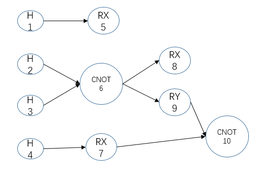
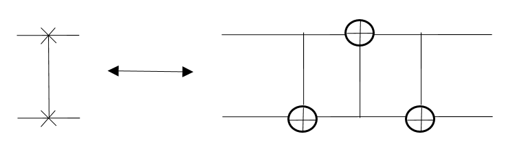

- [量子程序有向无环图](#量子程序有向无环图)
    - [构建量子程序有向无环图](#构建量子程序有向无环图)
    - [接口介绍](#接口介绍)
- [量子程序分层拓扑结构](#量子程序分层拓扑结构)
    - [构建量子程序分层拓扑结构](#构建量子程序分层拓扑结构)
- [量子程序转OriginIR](#量子程序转originir)
    - [接口介绍](#接口介绍-1)
    - [实例](#实例)
- [OriginIR转量子程序](#originir转量子程序)
    - [接口介绍](#接口介绍-2)
    - [实例](#实例-1)
- [量子程序转QASM](#量子程序转qasm)
    - [QASM介绍](#qasm介绍)
    - [实例](#实例-2)
- [量子程序转化为Quil](#量子程序转化为quil)
    - [接口介绍](#接口介绍-3)
    - [实例](#实例-3)
- [替换量子程序中指定结构的量子线路](#替换量子程序中指定结构的量子线路)
    - [接口介绍](#接口介绍-4)
    - [实例](#实例-4)


# 量子程序有向无环图

根据量子计算机在执行量子程序时，可以在同一时间段对所有的量子比特进行操作，但每个量子比特在同一时间段内只能被操作一个量子逻辑门，根据量子计算的这一特性，量子程序可以构建成一个有向无环图。

例如，我们构建一个量子程序：
```
auto prog = QProg();
prog << H(q[0])<<H(q[1])<<H(q[2])<<H(q[3])
    <<RX(q[0],PI/2)<<CNOT(q[1],q[2])
    <<RX(q[1],PI/2)<<RX(q[2],PI/2)
    <<RX(q[3],PI/2)<<CNOT(q[q[2],q[3]);
```
量子程序有向无环图为：



从上面的有向无环图我们可以看到，有向无环图的创建规则是：
1. 每一个量子逻辑门都是一个顶点；
2. 有向无环图的边的方向为量子比特执行量子逻辑门的顺序；
3. 当量子逻辑门为双门时，该顶点就有两条入边，，以此类推，如果是N量子比特量子逻辑门门，则有N条入边（假设该量子逻辑门操作的量子比特，在执行该门之前都有量子门操作）。

## 构建量子程序有向无环图
量子程序有向无环图类为QProgDAG。需要使用getQProgDAG接口：
```
QProgDAG prog_dag;
prog << H(q[0])<<H(q[1])<<H(q[2])<<H(q[3])
    <<RX(q[0],PI/2)<<CNOT(q[1],q[2])
    <<RX(q[1],PI/2)<<RX(q[2],PI/2)
    <<RX(q[3],PI/2)<<CNOT(q[q[2],q[3]);
getQProgDAG(prog,prog_dag);
```
## 接口介绍
constructAdjacencyMatrix:构建QProgDAG的邻接矩阵。
```
AdjacencyMatrix matrix;
prog_dag.constructAdjacencyMatrix(matrix);
```
AdjacencyMatrix是封装的 Eigen::MatrixXi，用于存储邻接矩阵。邻接矩阵的行数和列数都与DAG的顶点数相同，行列对应的元素表示行列分别对应的顶点是否相连，如果元素值为0代表不相连，如果是1代表相连。Eigen的使用方式可从[Eigen介绍](http://eigen.tuxfamily.org/dox/index.html "Eigen介绍")中获取。

getVertex：获取指定顶点对应的量子逻辑门。
```
auto qgate = prog_dag.getVertex(5);
```
getVertexNodeIter:获取指定顶点对应的顶点的迭代器。
```
auto qnode_iter = prog_dag.getVertexNodeIter(5);
```
# 量子程序分层拓扑结构
根据上文所述，同一个量子比特在同一时间段内不能被两个量子逻辑门操作。所以，一个量子逻辑门可分为多层，每一层中都是可在同一时间段内执行的量子逻辑门。分层拓扑结构的层间前后关系就是被执行的顺序。

我们可以根据已获得的量子程序有向无环图获取量子程序的分层拓扑结构。

量子程序有向无环图为：


量子程序分层拓扑结构：

```
H[RX],H[CNOT],H[CNOT],H[RX] |
RX[],CNOT[RX,RY],RX[CNOT]  | 
RX[],RY[CNOT] | 
CNOT []
```
[]内表示该量子逻辑门操作的量子比特下次将要执行的量子逻辑门。

## 构建量子程序分层拓扑结构

QProgDAG的getTopologicalSequence可获得指定量子程序的分层拓扑结构
```
QProgDAG prog_dag;
prog << H(q[0])<<H(q[1])<<H(q[2])<<H(q[3])
    <<RX(q[0],PI/2)<<CNOT(q[1],q[2])
    <<RX(q[1],PI/2)<<RX(q[2],PI/2)
    <<RX(q[3],PI/2)<<CNOT(q[q[2],q[3]);
getQProgDAG(prog,prog_dag);
TopologincalSequence seq;
prog_dag.getTopologicalSequence(seq);
```

# 量子程序转OriginIR

通过该功能，我们可以解析通过QPanda构建的量子程序，将其中包含的量子比特信息以及量子逻辑门操作信息提取出来，得到按固定格式存储的OriginIR指令集。
## 接口介绍
transformQProgToOriginIR：把量子程序转成OriginIR，第一个参数是目标量子程序，第二个参数是量子虚拟机指针，返回值为OriginIR指令集的字符串。
```
std::string str_originir = transformQProgToOriginIR(prog, machine);
```
## 实例
以下实例为您演示transformQProgToOriginIR接口的使用：
```
#include "Core/QPanda.h"
USING_QPANDA

int main()
{
	auto machine = initQuantumMachine(QMachineType::CPU);
	auto q = machine->allocateQubits(4);
	auto c = machine->allocateCBits(4);

	auto prog = QProg();
	auto cir = QCircuit();

	cir << Y(q[2]) << H(q[2]) << CNOT(q[0], q[1]);

	auto while_prog = CreateWhileProg(c[1], &cir);
	
	prog << H(q[0])
		<< Measure(q[1], c[1])
		<< while_prog;

	std::cout << 
		transformQProgToOriginIR(prog, machine)
		<< std::endl;

	destroyQuantumMachine(machine);
    	return 0;
}
```
具体步骤如下:
1. 首先在主程序中用 initQuantumMachine() 初始化一个量子虚拟机对象，用于管理后续一系列行为
2. 接着用 allocateQubits() 和 allocateCBits() 初始化量子比特与经典寄存器数目
3. 然后构建一个量子线路cir，并通过 "<<" 操作符将量子逻辑门和量子线路插入到量子程序prog中
4. 最后调用接口transformQProgToOriginIR()转换量子程序输出OriginIR指令集，并且用 destroyQuantumMachine() 释放系统资源

运行结果：

```
QINIT 4
CREG 4
H q[0]
MEASURE q[1],c[1]
QWHILE c[1]
Y q[2]
H q[2]
CNOT q[0],q[1]
ENDQWHILE
```
# OriginIR转量子程序
通过该功能，我们可以解析按照固定格式存储的OriginIR指令集文件，构建与之相对应的量子程序

## 接口介绍
transformOriginIRToQProg：OriginIR转量子程序，第一个参数是OriginIR程序的文件地址，第二个参数是量子虚拟机指针。返回值为量子程序QProg。
```
QProg prog = transformOriginIRToQProg(filename, machine);
```
## 实例
以下实例为您演示transformOriginIRToQProg接口的使用：
```
#include "Core/QPanda.h"
USING_QPANDA

int main()
{
	std::string filename = "testfile.txt";
	std::ofstream os(filename);
	os << R"(QINIT 4
		CREG 4
		DAGGER
		X q[1]
		X q[2]
		CONTROL q[1], q[2]
		RY q[0], (1.047198)
		ENDCONTROL
		ENDDAGGER
		MEASURE q[0], c[0]
		QIF c[0]
		H q[1]
		H q[2]
		RZ q[2], (2.356194)
		CU q[2], q[3], (3.141593, 4.712389, 1.570796, -1.570796)
		CNOT q[2], q[1]
        	ENDQIF

		)"
		;
	os.close();

	auto machine = initQuantumMachine(QMachineType::CPU);
	QProg prog = QPanda::transformOriginIRToQProg(filename, machine);

	std::cout <<
		transformQProgToOriginIR(prog, machine)
		<< std::endl;

	destroyQuantumMachine(machine);
	return 0;
}

```
具体步骤如下:
1. 首先编写OriginIR指令集，并将其保存到指定文件中
2. 接着在主程序中用 initQuantumMachine() 初始化一个量子虚拟机对象，用于管理后续一系列行为
3. 然后调用transformOriginIRToQProg()接口，把OriginIR指令集转换为量子程序QProg
4. 最后调用transformQProgToOriginIR()接口，把量子程序转为OriginIR指令集，通过比较输入的OriginIR指令集和转换生成的OriginIR指令集是否相同，判断OriginIR指令集是否正确转换成量子程序QProg，并且用 destroyQuantumMachine() 释放系统资源

运行结果：
```
QINIT 4
CREG 4
DAGGER
X q[1]
X q[2]
CONTROL q[1],q[2]
RY q[0],(1.047198)
ENCONTROL
ENDDAGGER
MEASURE q[0],c[0]
QIF c[0]
H q[1]
H q[2]
RZ q[2],(2.356194)
CU q[2],q[3],(3.141593,4.712389,-1.570796,1.570796)
CNOT q[2],q[1]
ENDQIF
```

# 量子程序转QASM

通过该功能模块，你可以解析通过QPanda2构建的量子程序，将其中包含的量子比特信息以及量子逻辑门操作信息提取出来，得到按固定格式存储的QASM指令集。

## QASM介绍
QASM(Quantum Assembly Language)是IBM公司提出的量子汇编语言，与 OriginIR 的语法规则类似，一段QASM代码如下所示：

```
OPENQASM 2.0;
include "qelib1.inc";
qreg q[10];
creg c[10];

x q[0];
h q[1];
tdg q[2];
sdg q[2];
cx q[0],q[2];
cx q[1],q[4];
u1(pi) q[0];
u2(pi,pi) q[1];
u3(pi,pi,pi) q[2];
cz q[2],q[5];
ccx q[3],q[4],q[6];
cu3(pi,pi,pi) q[0],q[1];
measure q[2] -> c[2];
measure q[0] -> c[0];
```

需要注意的是，QASM的语法格式与OriginIR形相似而神不同，主要区别有以下几点:
1. OriginIR对于需要进行转置共轭操作的量子逻辑门与量子线路，需要将目标置于DAGGER与ENDAGGER语句之间，而QASM会直接进行转化。
2. OriginIR支持对量子逻辑门与量子线路施加控制操作，而QASM不支持，在对量子程序转化QASM指令集之前，会对其中包含的控制操作进行分解。

QPanda提供了QASM转换工具接口 std::string transformQProgToQASM(QProg &, QuantumMachine*) 该接口使用非常简单，具体可参考下方示例程序。

## 实例

下面的例程通过简单的接口调用演示了量子程序转化QASM指令集的过程


```
#include "Core/QPanda.h"
USING_QPANDA

int main(void)
{
    auto qvm = initQuantumMachine();

    auto prog = CreateEmptyQProg();
    auto cir = CreateEmptyCircuit();

    auto q = qvm->allocateQubits(6);
    auto c = qvm->allocateCBits(6);


    cir << Y(q[2]) << H(q[2]);
    cir.setDagger(true);

    auto h1 = H(q[1]);
    h1.setDagger(true);

    prog << H(q[1])
         << X(q[2])
         << h1
         << RX(q[1], 2 / PI)
         << cir
         << CR(q[1], q[2], PI / 2)
         <<MeasureAll(q,c);

    std::cout << transformQProgToQASM(prog,qvm);

    destroyQuantumMachine(qvm);
    return 0;
}
```

具体步骤如下:

1. 首先在主程序中用 initQuantumMachine() 初始化一个量子虚拟机对象，用于管理后续一系列行为
2. 接着用 allocateQubits() 和 allocateCBits() 初始化量子比特与经典寄存器数目
3. 然后调用 CreateEmptyQProg() 构建一个空的量子程序，然后往该量子程序中插入量子逻辑门
4. 最后调用接口 transformQProgToQASM 输出QASM指令集并用 destroyQuantumMachine 释放系统资源。

运行结果如下：
```
OPENQASM 2.0;
include "qelib1.inc";
qreg q[6];
creg c[6];
h q[1];
x q[2];
hdg q[1];
rx(0.636620) q[1];
hdg q[2];
ydg q[2];
cr(1.570796) q[1],q[2];
measure q[0] -> c[0];
measure q[1] -> c[1];
measure q[2] -> c[2];
measure q[3] -> c[3];
measure q[4] -> c[4];
measure q[5] -> c[5];
```

# 量子程序转化为Quil

Quil可以从一个很低级的层次直接描述量子程序、量子算法，它的地位类似于经典计算机中的硬件描述语言或者汇编语言。Quil基本采用“指令+参数列表”的设计方法。一个简单的量子程序例子如下：

```
X 0
Y 1
CNOT 0 1
H 0
RX(-3.141593) 0
MEASURE 1 [0]
```
1. X 的作用是对目标量子比特进行 Pauli-X 门操作。与之类似的关键词有 Y 、Z 、 H 等等。
2. Y 的作用是对目标量子比特进行 Pauli-Y 门操作。
3. CNOT 的作用是对两个量子比特执行 CNOT 操作。输入参数为控制量子比特序号和目标量子比特序号。
4. H 的作用是对目标量子比特进行 Hadamard 门操作。
5. MEASURE 的作用对目标量子比特进行测量并将测量结果保存在对应的经典寄存器里面，输入参数为目标量子比特序号和保存测量结果的经典寄存器序号。

上述仅为Quil指令集语法的一小部分， 详细介绍请参考 [pyQuil](https://pyquil.readthedocs.io/en/stable/compiler.html "pyQuil") 。

## 接口介绍

QProgToQuil 类是QPanda2提供的一个将量子程序转换为Quil指令集的工具类，我们先用QPanda2构建一个量子程序：

```
QProg prog;
auto qvec = qvm->allocateQubits(4);
auto cvec = qvm->allocateCBits(4);

prog << X(qvec[0])
     << Y(qvec[1])
     << H(qvec[0])
     << RX(qvec[0], 3.14)
     << Measure(qvec[1], cvec[0]);
```

然后调用 QProgToQuil 类实现转化

```
QProgToQuil t(qvm);
t.transform(prog);
std::string instructions = t.getInsturctions();
```
我们还可以使用QPanda2封装的一个接口：

```
std::string instructions = transformQProgToQuil(prog, qvm);
```

## 实例 
```
#include "Core/QPanda.h"
USING_QPANDA

int main(void)
{
    auto qvm = initQuantumMachine(QMachineType::CPU);
    auto qubits = qvm->allocateQubits(4);
    auto cbits = qvm->allocateCBits(4);
    QProg prog;
    prog << X(qubits[0])
         << Y(qubits[1])
         << H(qubits[2])
         << RX(qubits[3], 3.14)
         << Measure(qubits[0], cbits[0]);

    std::string instructions = transformQProgToQuil(prog, qvm);
    std::cout << instructions << std::endl;
    destroyQuantumMachine(qvm);
    return 0;
}
```
运行结果：

```
X 0
Y 1
H 2
RX(3.140000) 3
MEASURE 0 [0]
```

# 替换量子程序中指定结构的量子线路
在量子计算中，存在一些量子逻辑门或量子线路是可以相互替代的：

```
SWAP i,j = CNOT i,j+CNOT j,i+CNOT i,j 
```
如图：



而在量子程序中，可能存在多个相同结构的子量子线路或多个相同的量子逻辑门，替换量子程序中指定结构的量子线路的功能就是找这些相同结构的子量子线路并把它们替换成目标量子线路。
## 接口介绍
graphReplace：替换量子程序中指定结构的量子线路,输入参数一为查询图量子线路节点，输入参数二为替换量子线路节点，输入参数三为查询结果序，输入参数四为空的量子程序，输入参数五为主线路的拓扑序列，输入参数六为量子虚拟机指针。

## 实例

```
#include "Core/QPanda.h"
USING_QPANDA

int main(void)
{
    auto qvm = initQuantumMachine();
    auto q = qvm->allocateQubits(5);
    auto c = qvm->allocateCBits(5);

/*
    0----H-----RX-----Z----CNOT----------------
                            |
    1----H-----X------H------------------------

    2----RY-----------------H------------------
                      |
    3---------CNOT---CNOT-----------RZ---------
               |            |
    4----H------------H----CNOT-----Y------RX--
*/
    auto prog = QProg();
    prog << H(q[0]) << H(q[1]) << RY(q[2], PI / 2) << H(q[4])
         << RX(q[0], PI / 2) << X(q[1]) << CNOT(q[4], q[3])
         << Z(q[0]) << H(q[1]) << CNOT(q[2], q[3]) << H(q[4])
         << CNOT(q[1], q[0]) << H(q[2]) << CNOT(q[3], q[4])
         << RZ(q[3], PI / 2) << Y(q[4])
         << RX(q[4], PI / 2);

    std::cout << "before replace" << std::endl;
    std::cout << transformQProgToOriginIR(prog, qvm) << endl << endl;

    auto query_cir = QCircuit();
    query_cir << H(q[0]) ;

    auto replace_cir = QCircuit();
    replace_cir << Y(q[0]);

    QNodeMatch dag_match;
    TopologincalSequence graph_seq;
    dag_match.getMainGraphSequence(prog, graph_seq);

    TopologincalSequence query_seq;
    dag_match.getQueryGraphSequence(query_cir, query_seq);

    MatchVector result;
    cout << dag_match.graphQuery(graph_seq, query_seq, result) << endl;

    QProg update_prog;
    dag_match.graphReplace(query_cir, replace_cir, result, graph_seq, update_prog, qvm);

    std::cout << "after replace" << std::endl;
    std::cout << transformQProgToOriginIR(update_prog, qvm);

    destroyQuantumMachine(qvm);
    return 0;
}
```

具体步骤如下:

1. 首先在主程序中用 initQuantumMachine() 初始化一个量子虚拟机对象
2. 接着用 allocateQubits() 和 allocateCBits() 初始化量子比特与经典寄存器数目
3. 然后构建主线路量子程序，打印出主线路的OriginIR；
4. 然后分别获取主量子线路图以及查询量子线路图的拓扑序列
5. 接着用graphQuery查询是否存在匹配的子图
6. 最后调用接口graphReplace进行量子线路的替换

运算结果

```
before replace
QINIT 5
CREG 5
H q[0]
H q[1]
RY q[2],(1.570796)
H q[4]
RX q[0],(1.570796)
X q[1]
CNOT q[4],q[3]
Z q[0]
H q[1]
CNOT q[2],q[3]
H q[4]
CNOT q[1],q[0]
H q[2]
CNOT q[3],q[4]
RZ q[3],(1.570796)
Y q[4]
RX q[4],(1.570796)

after replace
QINIT 5
CREG 5
RY q[2],(1.570796)
Y q[0]
Y q[1]
Y q[4]
RX q[0],(1.570796)
X q[1]
CNOT q[4],q[3]
Z q[0]
CNOT q[2],q[3]
Y q[1]
Y q[4]
CNOT q[1],q[0]
CNOT q[3],q[4]
Y q[2]
RZ q[3],(1.570796)
Y q[4]
RX q[4],(1.570796)
```
使用graphQuery需要注意
1. 量子程序中不能包含QIf，QWhile；
2. 目标量子线路和替代量子线路控制的量子比特必须一一对应。
