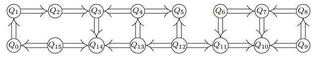
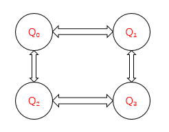

# 量子程序有向无环图

根据量子计算机在执行量子程序时，可以在同一时间段对所有的量子比特进行操作，但每个量子比特在同一时间段内只能被操作一个量子逻辑门，根据量子计算的这一特性，量子程序可以构建成一个有向无环图。

例如，我们构建一个量子程序：
```
auto prog = QProg();
prog << H(q[0])<<H(q[1])<<H(q[2])<<H(q[3])
    <<RX(q[0],PI/2)<<CNOT(q[1],q[2])
    <<RX(q[1],PI/2)<<RX(q[2],PI/2)
    <<RX(q[3],PI/2)<<CNOT(q[q[2],q[3]);
```
量子程序有向无环图为：


从上面的有向无环图我们可以看到，有向无环图的创建规则是：
1. 每一个量子逻辑门都是一个顶点；
2. 有向无环图的边的方向为量子比特执行量子逻辑门的顺序；
3. 当量子逻辑门为双门时，该顶点就有两条入边，，以此类推，如果是N量子比特量子逻辑门门，则有N条入边（假设该量子逻辑门操作的量子比特，在执行该门之前都有量子门操作）；

## 构建量子程序有向无环图
量子程序有向无环图类为QProgDAG。需要使用getQProgDAG接口：
```
QProgDAG prog_dag;
prog << H(q[0])<<H(q[1])<<H(q[2])<<H(q[3])
    <<RX(q[0],PI/2)<<CNOT(q[1],q[2])
    <<RX(q[1],PI/2)<<RX(q[2],PI/2)
    <<RX(q[3],PI/2)<<CNOT(q[q[2],q[3]);
getQProgDAG(prog,prog_dag);
```
## 接口介绍
constructAdjacencyMatrix:构建QProgDAG的邻接矩阵。
```
AdjacencyMatrix matrix;
prog_dag.constructAdjacencyMatrix(matrix);
```
AdjacencyMatrix是封装的 Eigen::MatrixXi，用于存储邻接矩阵。邻接矩阵的行数和列数都与DAG的顶点数相同，行列对应的元素表示行列分别对应的顶点是否相连，如果元素值为0代表不相连，如果是1代表相连。Eigen的使用方式可从[Eigen介绍](http://eigen.tuxfamily.org/dox/index.html "Eigen介绍")中获取。

getVertex：获取指定顶点对应的量子逻辑门。
```
auto qgate = prog_dag.getVertex(5);
```
getVertexNodeIter:获取指定顶点对应的顶点的迭代器。
```
auto qnode_iter = prog_dag.getVertexNodeIter(5);
```
# 量子程序分层拓扑结构
根据上文所述，同一个量子比特在同一时间段内不能被两个量子逻辑门操作。所以，一个量子逻辑门可分为多层，每一层中都是可在同一时间段内执行的量子逻辑门。分层拓扑结构的层间前后关系就是被执行的顺序。

我们可以根据已获得的量子程序有向无环图获取量子程序的分层拓扑结构。

量子程序有向无环图为：


量子程序分层拓扑结构：

```
H[RX],H[CNOT],H[CNOT],H[RX] |
RX[],CNOT[RX,RY],RX[CNOT]  | 
RX[],RY[CNOT] | 
CNOT []
```
[]内表示该量子逻辑门操作的量子比特下次将要执行的量子逻辑门。

## 构建量子程序分层拓扑结构

QProgDAG的getTopologincalSequence可获得指定量子程序的分层拓扑结构
```
QProgDAG prog_dag;
prog << H(q[0])<<H(q[1])<<H(q[2])<<H(q[3])
    <<RX(q[0],PI/2)<<CNOT(q[1],q[2])
    <<RX(q[1],PI/2)<<RX(q[2],PI/2)
    <<RX(q[3],PI/2)<<CNOT(q[q[2],q[3]);
getQProgDAG(prog,prog_dag);
TopologincalSequence seq;
prog_dag.getTopologincalSequence(seq);
```

# 量子程序转OriginIR

通过该功能，我们可以解析通过QPanda构建的量子程序，将其中包含的量子比特信息以及量子逻辑门操作信息提取出来，得到按固定格式存储的OriginIR指令集。

transformQProgToOriginIR：把量子程序转成OriginIR，第一个参数是目标量子程序，第二个参数是量子虚拟机指针，返回值为OriginIR程序字符串。
## 实例
以下实例为您演示transformQProgToOriginIR接口的使用：
1.	初始化虚拟机环境：调用initQuantumMachine接口构建一个量子虚拟机，向量子虚拟机申请20个量子比特和20个经典寄存器；
2.	构建量子程序：构建一个量子线路prog，通过 << 操作符把量子逻辑门和量子线路插入到prog中；
3.	转换量子程序：调用transformQProgToOriginIR转换量子程序，并打印出的到的OriginIR程序。


```
#include "Core/QPanda.h"
#include "include/Core/Utilities/Transform/QProgToOriginIR.h"
USING_QPANDA

int main()
{
    auto machine = initQuantumMachine(QMachineType::CPU);
    auto q = machine->allocateQubits(20);
    auto c = machine->allocateCBits(20);

    auto prog = QProg();
    auto cir = QCircuit();
    auto cir1 = QCircuit();

    cir << Y(q[2]) << H(q[2])<<CNOT(q[0],q[1])<<cir1;

    auto while_prog= CreateWhileProg(c[1], &cir);
    auto cprpg = H(q[0]);
    auto me = Measure(q[1], c[1]); 
    prog << cprpg << me << while_prog;

    std::cout<<
        transformQProgToOriginIR(prog, machine)
        <<std::endl;

    destroyQuantumMachine(machine);
}
```
运行结果：

```
QINIT 20
CREG 20
H q[1]
MEASURE q[1],c[1]
QWHILE c[1]
Y q[2]
H q[2]
CNOT q[0],q[1]
MEASURE q[1],c[1]
ENDQWHILE
```
# OriginIR转量子程序
transformOriginIRToQProg：OriginIR转量子程序，第一个参数是OriginIR程序的文件地址，第二个参数是量子虚拟机指针。返回值为量子程序QProg。

## 实例
以下实例为您演示transformOriginIRToQProg接口的使用：
1. 编写OriginIR程序，并把该程序保存到制定文件；
2. 初始化量子虚拟机。
3. 调用	transformOriginIRToQProg接口，把OriginIR程序转为QProg；
4. 调用transformQProgToOriginIR接口，把量子程序转为OriginIR,检验量子程序是否正确构建。

```
#include "Core/QPanda.h"
USING_QPANDA

int main()
{
	string filename = "testfile.txt";
	std::ofstream os(filename);
	os << R"(QINIT 4
		CREG 2
		RY q[3], (1.570796)
		DAGGER
		H q[1]
		H q[2]
		RZ q[2], (2.356194)
		CU q[2], q[3], (3.141593, 4.712389, 1.570796, -1.570796)
		RZ q[1], (4.712389)
		CU q[1], q[3], (3.141593, 4.712389, 1.570796, -3.141593)
		CNOT q[1], q[2]
		CNOT q[2], q[1]
		CNOT q[1], q[2]
		H q[2]
		CU q[2], q[1], (-0.785398, -1.570796, 0.000000, 0.000000)
		H q[1]
		SWAP q[1], q[2]
		ENDDAGGER
		DAGGER
		X q[1]
		CONTROL q[1], q[2]
		RY q[0], (3.141593)
		ENDCONTROL
		X q[1]
		X q[2]
		CONTROL q[1], q[2]
		RY q[0], (1.047198)
		ENDCONTROL
		X q[2]
		CONTROL q[1], q[2]
		RY q[0], (0.679674)
		ENDCONTROL
		ENDDAGGER
		MEASURE q[0], c[0]
		QIF c[0]
		DAGGER
		H q[1]
		H q[2]
		RZ q[2], (2.356194)
		CU q[2], q[3], (3.141593, 4.712389, 1.570796, -1.570796)
		RZ q[1], (4.712389)
		CU q[1], q[3], (3.141593, 4.712389, 1.570796, -3.141593)
		CNOT q[1], q[2]
		CNOT q[2], q[1]
		CNOT q[1], q[2]
		H q[2]
		CU q[2], q[1], (-0.785398, -1.570796, 0.000000, 0.000000)
		H q[1]
		ENDDAGGER 
        ENDQIF

		)"
		;
	os.close();

	init();
	extern QuantumMachine* global_quantum_machine;
	QProg prog = QPanda::transformOriginIRToQProg(filename, global_quantum_machine);

	std::cout << 
        transformQProgToOriginIR(prog, global_quantum_machine);
        <<std::endl;
	return 0;
}

```
运行结果：
```
QINIT 4
CREG 2
RY q[3], (1.570796)
DAGGER
H q[1]
H q[2]
RZ q[2], (2.356194)
CU q[2], q[3], (3.141593, 4.712389, 1.570796, -1.570796)
RZ q[1], (4.712389)
CU q[1], q[3], (3.141593, 4.712389, 1.570796, -3.141593)
CNOT q[1], q[2]
CNOT q[2], q[1]
CNOT q[1], q[2]
H q[2]
CU q[2], q[1], (-0.785398, -1.570796, 0.000000, 0.000000)
H q[1]
SWAP q[1], q[2]
ENDDAGGER
DAGGER
X q[1]
CONTROL q[1], q[2]
RY q[0], (3.141593)
ENDCONTROL
X q[1]
X q[2]
CONTROL q[1], q[2]
RY q[0], (1.047198)
ENDCONTROL
X q[2]
CONTROL q[1], q[2]
RY q[0], (0.679674)
ENDCONTROL
ENDDAGGER
MEASURE q[0], c[0]
QIF c[0]
DAGGER
H q[1]
H q[2]
RZ q[2], (2.356194)
CU q[2], q[3], (3.141593, 4.712389, 1.570796, -1.570796)
RZ q[1], (4.712389)
CU q[1], q[3], (3.141593, 4.712389, 1.570796, -3.141593)
CNOT q[1], q[2]
CNOT q[2], q[1]
CNOT q[1], q[2]
H q[2]
CU q[2], q[1], (-0.785398, -1.570796, 0.000000, 0.000000)
H q[1]
ENDDAGGER 
ENDQIF
```

# 量子程序转QASM

通过该功能模块，你可以解析通过QPanda2构建的量子程序，将其中包含的量子比特信息以及量子逻辑门操作信息提取出来，得到按固定格式存储的QASM指令集。

## QASM介绍
QASM(Quantum Assembly Language)是IBM公司提出的量子汇编语言，与 QRunes介绍 中的语法规则类似，一段QASM代码如下所示：

```
OPENQASM 2.0;
include "qelib1.inc";
qreg q[10];
creg c[10];

x q[0];
h q[1];
tdg q[2];
sdg q[2];
cx q[0],q[2];
cx q[1],q[4];
u1(pi) q[0];
u2(pi,pi) q[1];
u3(pi,pi,pi) q[2];
cz q[2],q[5];
ccx q[3],q[4],q[6];
cu3(pi,pi,pi) q[0],q[1];
measure q[2] -> c[2];
measure q[0] -> c[0];
```

需要注意的是，QASM的语法格式与OriginIR形相似而神不同，主要区别有以下几点:
1. OriginIR对于需要进行转置共轭操作的量子逻辑门与量子线路，需要将目标置于DAGGER与ENDAGGER语句之间，而QASM会直接进行转化。
2. OriginIR支持对量子逻辑门与量子线路施加控制操作，而QASM不支持，在对量子程序转化QASM指令集之前，会对其中包含的控制操作进行分解。

QPanda提供了QASM转换工具接口 std::string transformQProgToQASM(QProg &, QuantumMachine*) 该接口使用非常简单，具体可参考下方示例程序。

## 实例

下面的例程通过简单的接口调用演示了量子程序转化QASM指令集的过程


```
#include "Core/QPanda.h"
USING_QPANDA

int main(void)
{
    auto qvm = initQuantumMachine();

    auto prog = CreateEmptyQProg();
    auto cir = CreateEmptyCircuit();

    auto q = qvm->allocateQubits(6);
    auto c = qvm->allocateCBits(6);


    cir << Y(q[2]) << H(q[2]);
    cir.setDagger(true);

    auto h1 = H(q[1]);
    h1.setDagger(true);

    prog << H(q[1])
         << X(q[2])
         << h1
         << RX(q[1], 2 / PI)
         << cir
         << CR(q[1], q[2], PI / 2)
         <<MeasureAll(q,c);

    std::cout << transformQProgToQASM(prog,qvm);

    destroyQuantumMachine(qvm);
    return 0;
}
```

具体步骤如下:

1. 首先在主程序中用 initQuantumMachine() 初始化一个量子虚拟机对象，用于管理后续一系列行为
2. 接着用 allocateQubits() 和 allocateCBits() 初始化量子比特与经典寄存器数目
3. 然后调用 CreateEmptyQProg() 构建量子程序
4. 最后调用接口 transformQProgToQASM 输出QASM指令集并用 destroyQuantumMachine 释放系统资源。

运行结果如下：
```
openqasm 2.0;
qreg q[6];
creg c[6];
h q[1];
x q[2];
hdg q[1];
rx(0.636620) q[1];
hdg q[2];
ydg q[2];
cr(1.570796) q[1],q[2];
measure q[0] -> c[0];
measure q[1] -> c[1];
measure q[2] -> c[2];
measure q[3] -> c[3];
measure q[4] -> c[4];
measure q[5] -> c[5];
```

# 量子程序转化为Quil

Quil可以从一个很低级的层次直接描述量子程序、量子算法，它的地位类似于经典计算机中的硬件描述语言或者汇编语言。Quil基本采用“指令+参数列表”的设计方法。一个简单的量子程序例子如下：

```
X 0
Y 1
CNOT 0 1
H 0
RX(-3.141593) 0
MEASURE 1 [0]
```
1. X 的作用是对目标量子比特进行 Pauli-X 门操作。与之类似的关键词有 Y 、Z 、 H 等等。
2. Y 的作用是对目标量子比特进行 Pauli-Y 门操作。
3. CNOT 的作用是对两个量子比特执行 CNOT 操作。输入参数为控制量子比特序号和目标量子比特序号。
4. H 的作用是对目标量子比特进行 Hadamard 门操作。
5. MEASURE 的作用对目标量子比特进行测量并将测量结果保存在对应的经典寄存器里面，输入参数为目标量子比特序号和保存测量结果的经典寄存器序号。

上述仅为Quil指令集语法的一小部分， 详细介绍请参考 [pyQuil](https://pyquil.readthedocs.io/en/stable/compiler.html "pyQuil") 。

## 接口介绍

QProgToQuil 类是QPanda2提供的一个将量子程序转换为Quil指令集的工具类，我们先用QPanda2构建一个量子程序：

```
QProg prog;
auto qubits = qvm->allocateQubits(4);
auto cbits = qvm->allocateCBits(4);

prog << X(qvec[0])
     << Y(qvec[1])
     << H(qvec[0])
     << RX(qvec[0], 3.14)
     << Measure(qvec[1], cvec[0]);
```

然后调用 QProgToQuil 类实现转化

```
QProgToQuil t(qvm);
t.transform(prog);
std::string instructions = t.getInsturctions();
```
我们还可以使用QPanda2封装的一个接口：

```
std::string instructions = transformQProgToQuil(prog, qvm);
```

## 实例 
```
#include "Core/QPanda.h"
USING_QPANDA

int main(void)
{
    auto qvm = initQuantumMachine(QMachineType::CPU);
    auto qubits = qvm->allocateQubits(4);
    auto cbits = qvm->allocateCBits(4);
    QProg prog;
    prog << X(qubits[0])
         << Y(qubits[1])
         << H(qubits[2])
         << RX(qubits[3], 3.14)
         << Measure(qubits[0], cbits[0]);

    std::string instructions = transformQProgToQuil(prog, qvm);
    std::cout << instructions << std::endl;
    destroyQuantumMachine(qvm);
    return 0;
}
```
运行结果：

```
X 0
Y 1
H 2
RX(3.140000) 3
MEASURE 0 [0]
```

# 替换量子程序中指定结构的量子线路
在量子计算中，存在一些量子逻辑门或量子线路是可以相互替代的：

```
SWAP i,j = CNOT i,j+H i+Hj+CNOT i,j+H i+Hj +CNOT i,j 
```
如图：


而在量子程序中，可能存在多个相同结构的子量子线路或多个相同的量子逻辑门，替换量子程序中指定结构的量子线路的功能就是找这些相同结构的子量子线路并把它们替换成目标量子线路。
## 接口介绍
replaceSubGraph：替换量子程序中指定结构的量子线路,输入参数一为目标量子程序，输入参数二为目标量子线路，输入参数三为替换量子线路。返回值为替换后的量子程序。

```
QProg new_prog = replaceSubGraph(prog,target_circuit,replace_circuit);
```
## 实例

```
#include "Core/QPanda.h"
USING_QPANDA

int main(void)
{
    auto qvm = initQuantumMachine(QMachineType::CPU);
    auto qubits = qvm->allocateQubits(2);
    auto cbits = qvm->allocateCBits(2);
    QProg prog;
    prog << H(qubits[0])
         << H(qubits[1])
         << CNOT(qubits[0],qubits[1])
         << RX(qubits[0], 3.14)
         << H(qubits[1])
         << Measure(qubits[0], cbits[0]);
    QCircuit target_cir;
    target_cir<< H(qubits[1])
              << CNOT(qubits[0],qubits[1])
              << H(qubits[1]);
    QCircuit replace_cir;
    replace_cir <<  CZ(qubits[0],qubits[1]);

    std::string instructions = transformQProgToOriginIR(prog, qvm);
    std::cout << "before replace" << std::endl;
    std::cout << instructions << std::endl;
    std::cout << std::endl;
    auto new_prog = replaceSubGraph(prog,target_cir,replace_cir);

    std::string new_instructions = transformQProgToOriginIR(prog, qvm);
    std::cout << "after replace" << std::endl;
    std::cout << instructions << std::endl;
    destroyQuantumMachine(qvm);
    return 0;
}
```

具体步骤如下:

1. 首先在主程序中用 initQuantumMachine() 初始化一个量子虚拟机对象，用于管理后续一系列行为
2. 接着用 allocateQubits() 和 allocateCBits() 初始化量子比特与经典寄存器数目
3. 然后构建prog、target_cir、replace_cir，打印出prog的OriginIR；
4. 最后调用接口 replaceSubGraph替代目标量子线路，并打印出new_prog的OriginIR。

运算结果

```
before replace
QINIT 2
CREG 2
H q[0]
H q[1]
CNOT q[0],q[1]
RX q[0], (3.14)
H q[1]
MEASURE q[0], c[0]

after replace
QINIT 2
CREG 2
H q[0]
CZ q[0],q[1]
RX q[0], (3.14)
MEASURE q[0], c[0]
```
使用replaceSubGraph需要注意
1. 量子程序中不能包含QIf，QWhile；
2. 目标量子线路和替代量子线路控制的量子比特必须一一对应。

# 获取量子线路对应矩阵
接口getMatrix可以获得输入线路的对应矩阵，输入参数一个量子线路QCircuit，

使用getMatrix需要注意的是量子线路中不能包含测量操作。
## 实例
```
#include "Core/QPanda.h"
USING_QPANDA

int main(void)
{
    auto qvm = initQuantumMachine(QMachineType::CPU);
    auto qubits = qvm->allocateQubits(2);
    auto cbits = qvm->allocateCBits(2);

    target_cir<< H(qubits[1])
              << CNOT(qubits[0],qubits[1])
              << H(qubits[1]);

    auto cir_Matrix = getMatrix(target_cir);

    destroyQuantumMachine(qvm);
    return 0;
}
```

具体步骤如下:

1. 首先在主程序中用 initQuantumMachine() 初始化一个量子虚拟机对象，用于管理后续一系列行为
2. 接着用 allocateQubits() 和 allocateCBits() 初始化量子比特与经典寄存器数目
3. 然后构建target_cir；
4. 最后调用接口 getMatrix输出量子线路的对应矩阵；

# 判断量子逻辑门是否匹配量子拓扑结构。
每一款量子芯片都有其特殊的量子比特拓扑结构,例如IBM QX3：



从图中可知，量子芯片中的每个量子比特不是两两相连的，不相连的量子比特之间是不能直接执行多门操作的。所以在执行量子程序之前需要先判断量子程序中的双门（多门）操作是否适配量子比特拓扑结构。

## 接口介绍

isMatchTopology：判断量子逻辑门是否符合量子比特拓扑结构。第一个输入参数是目标量子逻辑门QGate，第二个输入参数是量子比特拓扑结构，返回值为布尔值，表示目标量子逻辑门是否满足量子比特拓扑结构。True为满足，False为不满足。
```

vector<vector<int>> 
    qubits_topologincal = { {0,1,1,0},
                            {1,0,0,1},
                            {1,0,0,1},
                            {0,1,1,0} };

bool result = QCircuitInfo::
    isMatchTopology(CNOT(q[1],q[3]),qubits_topologincal)
```
在使用isMatchTopology前需要先构建指定量子芯片的量子比特拓扑结构邻接矩阵qubits_topologincal。

从以上示例可以看出，qubits_topologincal有四个量子比特，量子比特拓扑图如下：



CNOT逻辑门操作的是1,3号量子比特，而从图中可以看出1,3号量子比特时相连的，所以得到的结果为true。

# 获得指定位置的量子逻辑门的相邻量子逻辑门
接口getAdjacentQGateType可以获得量子程序中指定位置的量子逻辑门的相邻逻辑门。第一个输入参数为目标量子程序QProg，第二个是目标量子逻辑门在量子程序中的迭代器，第三个输出参数目标量子逻辑门相邻量子逻辑门迭代器的集合。
## 实例
以下实例展示getAdjacentQGateType接口的使用方式：
1. 构建一个量子程序prog；
2. 获取prog的第一个量子逻辑门的迭代器node_iter；
3. 调用getAdjacentQGateType接口获取node_iter的相邻逻辑门的迭代器集合。

```
prog << H(q[0])<<H(q[1])<<H(q[2])<<H(q[3])
    <<RX(q[0],PI/2)<<CNOT(q[1],q[2])
    <<RX(q[1],PI/2)<<RX(q[2],PI/2)
    <<RX(q[3],PI/2)<<CNOT(q[q[2],q[3]);
auto node_iter= prog.getFirstNodeIter();
vector<NodeIter> node_iter_vector;
QCircuitInfo::getAdjacentQGateType(prog,node_iter,node_iter_vector);
```
在使用getAdjacentQGateType接口时，我们需要注意以下几点：
1. 目标量子逻辑门相邻量子逻辑门迭代器的集合永远包含两个元素；第一个元素是前一个量子逻辑门的迭代器，第二个元素是后一个量子逻辑门的迭代器。

2. 如果目标量子逻辑门是量子程序的第一个节点，那么输出的参数目标量子逻辑门相邻量子逻辑门迭代器的集合中则只能获取目标量子逻辑门后一个量子逻辑门的迭代器，集合的第一个元素为空迭代器。

3. 如果目标量子逻辑门是量子程序的最后一个量子逻辑门，那么输出的参数目标量子逻辑门相邻量子逻辑门迭代器的集合中则只能获取目标量子逻辑门前一个量子逻辑门的迭代器，集合的第二个元素为空迭代器。
4. 如果目标量子逻辑门前一个节点时QIf，那么输出的参数目标量子逻辑门相邻量子逻辑门迭代器的集合中则只能获取目标量子逻辑门后一个量子逻辑门的迭代器，集合的第一个元素为空迭代器。

5. 如果目标量子逻辑门后一个节点时QIf，那么输出的参数目标量子逻辑门相邻量子逻辑门迭代器的集合中则只能获取目标量子逻辑门前一个量子逻辑门的迭代器，集合的第二个元素为空迭代器。

6. 如果目标量子逻辑门是QWhile的第一个量子逻辑门，那么输出的参数目标量子逻辑门相邻量子逻辑门迭代器的集合中则只能获取目标量子逻辑门后一个量子逻辑门的迭代器，集合的第一个元素为空迭代器。

7. 如果目标量子逻辑门是QWhile的最后量子逻辑门，那么输出的参数目标量子逻辑门相邻量子逻辑门迭代器的集合中则只能获取目标量子逻辑门前一个量子逻辑门的迭代器，集合的第二个元素为空迭代器。

# 判断两个量子逻辑门是否可交换位置
接口isSwappable可判断量子程序中两个指定位置的量子逻辑门是否可以交换位置。输入参数一为量子程序QProg，输入参数二，三是需要判断的两个量子逻辑门的迭代器。返回值为布尔值，True表示可交换，False表示不可交换。

## 实例
以下实例展示isSwappable接口的使用方式：
1. 构建一个量子程序prog；
2. 获取prog的第一个量子逻辑门的迭代器node_iter和最后一个量逻辑门的迭代器last_node_iter；
3. 调用getAdjacentQGateType接口获取node_iter的相邻逻辑门的迭代器集合。

```
prog << H(q[0])<<H(q[1])<<H(q[2])<<H(q[3])
    <<RX(q[0],PI/2)<<CNOT(q[1],q[2])
    <<RX(q[1],PI/2)<<RX(q[2],PI/2)
    <<RX(q[3],PI/2)<<CNOT(q[q[2],q[3]);
auto node_iter= prog.getFirstNodeIter();
auto last_node_iter= prog.getLastNodeIter();
vector<NodeIter> node_iter_vector;
bool result = QCircuitInfo::isSwappable(prog,node_iter,last_node_iter);
```

# 判断逻辑门是否属于量子芯片支持的量子逻辑门集合
量子芯片支持的量子逻辑门集合可在元数据配置文件QPandaConfig.xml 中配置。如果我们没有设置配置文件，QPanda会默认设置一个默认量子逻辑门集合。

默认集合如下所示：
```
    single_gates.push_back("RX");
    single_gates.push_back("RY");
    single_gates.push_back("RZ");
    single_gates.push_back("X1");
    single_gates.push_back("H");
    single_gates.push_back("S");

    double_gates.push_back("CNOT");
    double_gates.push_back("CZ");
    double_gates.push_back("ISWAP");
```
配置文件可仿照下面设置:
```
<QGate>
    <SingleGate>
        <Gate time = "2">rx</Gate>
        <Gate time = "2">Ry</Gate>
        <Gate time = "2">RZ</Gate>
        <Gate time = "2">S</Gate>
        <Gate time = "2">H</Gate>
        <Gate time = "2">X1</Gate>
    </SingleGate>
    <DoubleGate>
        <Gate time = "5">CNOT</Gate>
        <Gate time = "5">CZ</Gate>
        <Gate time = "5">ISWAP</Gate>
    </DoubleGate>
</QGate>
```
从上面的示例中我们可以得到，量子芯片支持RX，RY，RZ，S，H，X1，CNOT，CZ，ISWAP门。在配置文件配置完成后，我们可以调用接口isSupportedGateType，判断逻辑门是否属于量子芯片支持的量子逻辑门集合。isSupportedGateType接口只有一个参数目标量子逻辑门；
```
auto qgate = X(q[1])
bool result = isSupportedGateType(qgate);
```